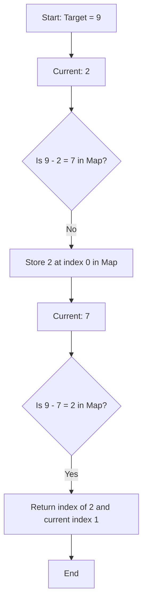

# 🎓 Expert Mentoring: Two Sum

The "Two Sum" problem is the "Hello World" of algorithmic patterns. It’s the perfect introduction to how we can use **memory** (storing data) to save **time** (speeding up our search).

---

### 1. Problem Understanding

Imagine you are at a party with a group of friends, and everyone is wearing a numbered badge. You are told: **"Find two friends whose badge numbers add up exactly to 10."**

- **Example:** You see friends with numbers `[2, 7, 11, 15]`.
- **The Goal:** You notice (too small), but wait! and are in the list.
- **Target:** .
- **Result:** You would point to the person with `2` (at index 0) and the person with `7` (at index 1).

**Constraints:** You can't use the same person twice, and there is always exactly one right answer.

---

### 2. Pattern Recognition: The "Complement" Search

The secret to solving this efficiently is changing how you think about the math. Instead of looking for "two numbers that add to 9," look for a **complement**.

If you are holding the number **2** and the target is **9**, you don't need to look for "any" number—you are specifically looking for **7** ().

**The Technique: Hash Maps (The Instant Memory)**
A Hash Map (or Dictionary) allows us to store numbers we’ve already seen and check if our "complement" is among them in **constant time** .

---

### 3. Visual Explanation



---

### 4. Step-by-Step Solution

Let's walk through `nums = [3, 2, 4]` and `target = 6`.

1. **Initialize:** Create an empty Hash Map called `visited`.
2. **Index 0 (Value 3):**

- Need: .
- Is `3` in `visited`? No.
- Add `3` to `visited`: `{3: 0}`.

3. **Index 1 (Value 2):**

- Need: .
- Is `4` in `visited`? No.
- Add `2` to `visited`: `{3: 0, 2: 1}`.

4. **Index 2 (Value 4):**

- Need: .
- Is `2` in `visited`? **Yes!**
- Grab the index of `2` from the map (which is `1`) and our current index (`2`).

5. **Finish:** Return `[1, 2]`.

---

### 5. Code Implementation (Java)

```java
/**
 * Time Complexity: O(N) - We only pass through the array once.
 * Space Complexity: O(N) - In the worst case, we store almost every element in the map.
 */
import java.util.HashMap;
import java.util.Map;

class Solution {
    public int[] twoSum(int[] nums, int target) {
        // This Map will store: Key = Number Value, Value = Index of that number
        Map<Integer, Integer> visitedNumbers = new HashMap<>();

        for (int i = 0; i < nums.size; i++) {
            int currentNumber = nums[i];

            // The "Complement" is what we need to reach the target
            int complement = target - currentNumber;

            // Check if we have already seen the complement earlier in the array
            if (visitedNumbers.containsKey(complement)) {
                // If found, return the index of the complement and the current index
                return new int[] { visitedNumbers.get(complement), i };
            }

            // If not found, "remember" this number and its index for future steps
            visitedNumbers.put(currentNumber, i);
        }

        // The problem guarantees a solution, so we should never reach here
        throw new IllegalArgumentException("No two sum solution");
    }
}

```

---

### 6. Complexity Analysis

- **Time Complexity: **
- We visit each number in the array exactly once. For each number, looking up its complement in a Hash Map takes almost no time (constant time).

- **Space Complexity: **
- We use extra space to store the numbers in our Hash Map. If the array has a million numbers and the answer is the very last two, we might store 999,999 numbers.

---

### 7. Similar Problems

Now that you know how to use "Memory" to find "Complements," try these:

1. **LeetCode 167: Two Sum II - Input Array Is Sorted** (A version where you can use "Two Pointers" instead of a Map!).
2. **LeetCode 15: 3Sum** (The bigger brother of Two Sum—finding three numbers that add to zero).
3. **LeetCode 217: Contains Duplicate** (Using a Set/Map to remember what you've seen).

---

### 8. Key Takeaways

- **Target - Current = Complement:** This simple math trick turns a search problem into a lookup problem.
- **One Pass:** By checking the map _before_ adding the current number, we ensure we don't use the same element twice.
- **Space-Time Trade-off:** We "pay" for speed using memory. time is much faster than (nested loops), but it requires space.
