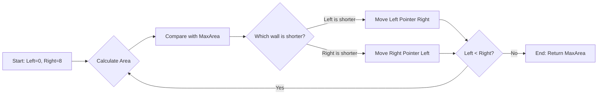

# 🎓 Expert Mentoring: Container With Most Water

This problem is a classic example of how to use logic to avoid checking millions of useless possibilities. We’re going to learn how to find the "best" option by narrowing our search window.

---

### 1. Problem Understanding

Imagine you have a row of vertical sticks of different heights. You want to pick two sticks and use them as the walls of a glass tank. You want to find the two sticks that can hold the **most water**.

- **The Rule:** The water level is limited by the **shorter** stick. If one stick is 10 inches tall and the other is 2 inches tall, the water can only be 2 inches deep before it spills over the shorter wall.
- **The Math:** The amount of water is the `Distance between sticks` (width) multiplied by the `Height of the shorter stick`.

**Example:**
Input: `[1, 8, 6, 2, 5, 4, 8, 3, 7]`
If we pick the first stick (1) and the last stick (7):

- Distance = 8
- Height = 1 (the shorter one)
- Water =

---

### 2. Pattern Recognition: Two Pointers (The Shrinking Window)

A naive solution would be to compare every possible pair of sticks. If you have 1,000 sticks, that's nearly 500,000 checks!

Instead, we use the **Two Pointers** pattern.

1. Start with the widest possible container (one pointer at the very left, one at the very right).
2. Calculate the water.
3. **The Big Logic:** To find more water, we _must_ move one of our pointers inward. Which one? **Move the shorter one.** \* Why? Because the shorter stick is the "bottleneck." Moving the taller stick won't help—the water is already limited by the short one, and moving inward only makes the width smaller. Our only hope for more water is to find a taller stick to replace our current short one.

**When to use this:**

- When you are looking for an optimal range or pair in a linear array.
- When "squeezing" the window from both ends helps eliminate choices that couldn't possibly be better.

---

### 3. Visual Explanation



---

### 4. Step-by-Step Solution

Let's use a small example: `heights = [1, 5, 4, 3]`

1. **Start:** `left = 0` (height 1), `right = 3` (height 3).

- Width = .
- Min Height = 1.
- Area = . **Max = 3**.

2. **Move:** Stick at `left` (1) is shorter than stick at `right` (3). Move `left` to index 1.
3. **Next Step:** `left = 1` (height 5), `right = 3` (height 3).

- Width = .
- Min Height = 3.
- Area = . **Max = 6**.

4. **Move:** Stick at `right` (3) is shorter than stick at `left` (5). Move `right` to index 2.
5. **Next Step:** `left = 1` (height 5), `right = 2` (height 4).

- Width = .
- Min Height = 4.
- Area = . (Max stays 6).

6. **Finish:** Pointers meet. The biggest tank we found was **6**.

---

### 5. Code Implementation (Java)

```java
/**
 * Time Complexity: O(N) - We only look at each stick once as the pointers move inward.
 * Space Complexity: O(1) - We only store a few numbers (pointers and maxArea).
 */
class Solution {
    public int maxArea(int[] height) {
        int maxArea = 0;
        int left = 0;
        int right = height.length - 1;

        while (left < right) {
            // Calculate the width between the two pointers
            int width = right - left;

            // The water level is determined by the shorter of the two walls
            int currentHeight = Math.min(height[left], height[right]);

            // Update the maximum area if we found a bigger container
            int currentArea = width * currentHeight;
            maxArea = Math.max(maxArea, currentArea);

            // Logic: Move the pointer pointing to the shorter wall
            // We want to find a taller wall to potentially increase the area
            if (height[left] < height[right]) {
                left++;
            } else {
                right--;
            }
        }

        return maxArea;
    }
}

```

---

### 6. Complexity Analysis

- **Time Complexity: **
- We start with pointers at the ends and they move toward each other. Every single step, the distance between them shrinks by 1. We will finish in exactly steps.

- **Space Complexity: **
- We don't use any extra arrays or lists. Just three integers (`left`, `right`, `maxArea`).

---

### 7. Similar Problems

1. **LeetCode 42: Trapping Rain Water** (A much harder version of this, but uses similar pointer logic!).
2. **LeetCode 15: 3Sum** (Uses two pointers to find triplets).
3. **LeetCode 167: Two Sum II - Input Array Is Sorted** (The classic intro to Two Pointers).

---

### 8. Key Takeaways

- **Identify the Constraint:** In this problem, the height of the container is limited by the **shorter** side.
- **Greedy Movement:** Moving the shorter pointer is "greedy"—it’s the only move that has a chance of making the container better.
- **Width vs. Height:** As the width decreases, you _must_ find a significantly taller height to compensate for the lost width.

Would you like to try the **Trapping Rain Water** problem next to see how this pattern evolves? Also, don't worry about the cleanup—Debu is on dish duty tonight!
