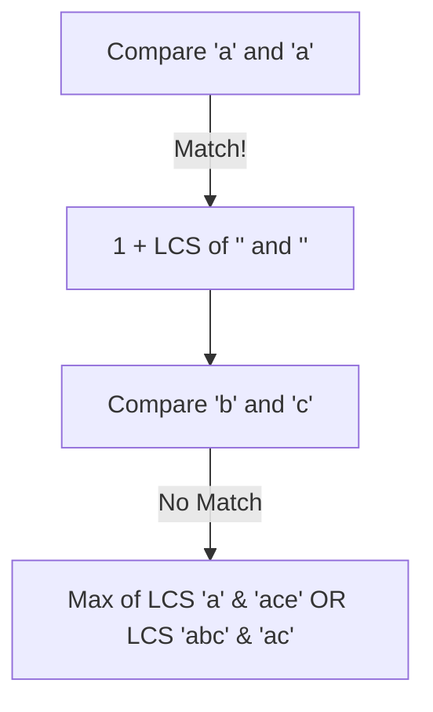

# 🎓 Expert Mentoring: Longest Common Subsequence (LCS)

The "Longest Common Subsequence" problem is the gold standard for understanding how computers compare things—like how scientists compare DNA strands or how your computer tells the difference between two versions of a file (the "diff" command).

---

### 1. Problem Understanding

Imagine you have two necklaces with colored beads. You want to find the longest sequence of colors that appears in **both** necklaces, in the **same relative order**, even if there are other beads in between.

- **Example:**
- Necklace 1: `A B C D E`
- Necklace 2: `A C E`
- **Result:** `3` (The sequence `A -> C -> E` appears in both).

- **Another Example:**
- Necklace 1: `A B C`
- Necklace 2: `D E F`
- **Result:** `0` (They share nothing).

**The Rule:** You can skip beads, but you cannot change their order. `A C E` is a subsequence of `A B C D E`, but `E C A` is not.

---

### 2. Pattern Recognition: 2D Dynamic Programming

When you have **two** strings and you need to find a relationship between them, you almost always use a **2D Grid (Matrix)**.

**The Strategy:**
We build a table where one string is the "rows" and the other is the "columns." Every cell in the table `dp[i][j]` represents the answer to: _"What is the LCS if we only looked at the first letters of String 1 and the first letters of String 2?"_

**The Logic:**

1. **If the letters match:** We take the best answer we had _before_ these two letters (`dp[i-1][j-1]`) and add **1**.
2. **If the letters don't match:** We take the best answer from either "ignoring the current letter of String 1" or "ignoring the current letter of String 2."

---

### 3. Visual Explanation

Let's look at `text1 = "abcde"` and `text2 = "ace"`.



**The Table Build:**
| | "" | a | c | e |
|---|---|---|---|---|
| **""** | 0 | 0 | 0 | 0 |
| **a** | 0 | 1 | 1 | 1 |
| **b** | 0 | 1 | 1 | 1 |
| **c** | 0 | 1 | 2 | 2 |
| **d** | 0 | 1 | 2 | 2 |
| **e** | 0 | 1 | 2 | 3 |

---

### 4. Step-by-Step Solution

1. **Initialize:** Create a 2D array `dp[text1.length + 1][text2.length + 1]` filled with zeros.
2. **Outer Loop:** Move through each character of `text1` (rows).
3. **Inner Loop:** Move through each character of `text2` (columns).
4. **Decide:**

- If `text1[i-1] == text2[j-1]`, then `dp[i][j] = 1 + dp[i-1][j-1]`.
- Else, `dp[i][j] = Math.max(dp[i-1][j], dp[i][j-1])`.

5. **Final Result:** The value in the bottom-right cell is our answer.

---

### 5. Code Implementation (Java)

```java
/**
 * Time Complexity: O(M * N) - Where M and N are the lengths of the two strings.
 * Space Complexity: O(M * N) - We store a 2D grid of size M x N.
 */
class Solution {
    public int longestCommonSubsequence(String text1, String text2) {
        int m = text1.length();
        int n = text2.length();

        // We add +1 to represent the empty string case
        int[][] dp = new int[m + 1][n + 1];

        // Start filling the grid
        for (int i = 1; i <= m; i++) {
            for (int j = 1; j <= n; j++) {
                // If characters match, move diagonally from the previous best result
                if (text1.charAt(i - 1) == text2.charAt(j - 1)) {
                    dp[i][j] = 1 + dp[i - 1][j - 1];
                }
                // If they don't match, take the best result from either the top or left cell
                else {
                    dp[i][j] = Math.max(dp[i - 1][j], dp[i][j - 1]);
                }
            }
        }

        // The answer is the longest subsequence using all characters of both strings
        return dp[m][n];
    }
}

```

---

### 6. Complexity Analysis

- **Time Complexity: **
- We fill every cell in the grid once. If both strings are 1,000 characters, we do 1,000,000 operations.

- **Space Complexity: **
- We create a 2D array to store the results.
- _Expert Tip:_ This can be optimized to space if we only keep the current and previous rows!

---

### 7. Similar Problems

1. **LeetCode 583: Delete Operation for Two Strings** (How many steps to make them equal? Hint: Use LCS!).
2. **LeetCode 718: Maximum Length of Repeated Subarray** (The same logic, but for "substrings" where order must be continuous).
3. **LeetCode 1092: Shortest Common Supersequence** (The "opposite" of LCS).

---

### 8. Key Takeaways

- **Matching = Diagonal + 1:** When items match, you build on the solution that didn't include either of these two items.
- **Not Matching = Max of Neighbors:** If they don't match, the best you can do is the best you've already found.
- **Empty String Base Case:** Always include a row and column of 0s to represent comparing a string against nothing.
