# 🎓 Expert Mentoring: Best Time to Buy and Sell Stock

This problem is the perfect introduction to the **Sliding Window** or **Greedy** approach. It’s all about finding the single best "valley" to buy in and the single best "peak" to sell in, with one catch: you must buy before you can sell!

---

### 1. Problem Understanding

Imagine you are looking at the price of a cool new gadget over a week. You want to make the most money possible by buying it on one day and selling it on a different day in the future.

- **Example:** `prices = [7, 1, 5, 3, 6, 4]`
- **The Goal:** Find the biggest gap between a "low" price and a later "high" price.
- **The Catch:** You can't sell on Monday and buy on Tuesday. Time only moves forward!

In this example:

1. Buy at `1` (Day 2).
2. Sell at `6` (Day 5).
3. **Profit:** .

---

### 2. Pattern Recognition: One-Pass Greedy / Sliding Window

A naive way would be to compare every single day with every day that comes after it. But that is slow (). Instead, we use a **One-Pass** strategy.

**The Strategy:**
As we walk through the days, we keep track of two things:

1. **The Lowest Price:** "What's the cheapest I've seen this gadget so far?"
2. **The Maximum Profit:** "If I sold today at the current price, would I make more money than any other deal I've seen?"

**When to use this:**

- When you need to find a maximum difference between two elements in an array.
- When the "order" of elements matters (you need to process from left to right).

---

### 3. Visual Explanation

```mermaid
graph LR
    A[Start: MinPrice=Infinity, MaxProfit=0] --> B[Day 1: 7]
    B --> B1[Update MinPrice: 7]
    B1 --> C[Day 2: 1]
    C --> C1[Update MinPrice: 1]
    C1 --> D[Day 3: 5]
    D --> D1["Profit (5-1) = 4. Update MaxProfit: 4"]
    D1 --> E[Day 4: 3]
    E --> E1["Profit (3-1) = 2. MaxProfit stays 4"]
    E1 --> F[Day 5: 6]
    F --> F1["Profit (6-1) = 5. Update MaxProfit: 5"]

```



---

### 4. Step-by-Step Solution

Let's use `prices = [7, 1, 5, 3, 6, 4]`.

1. **Start:** `minPrice = 7`, `maxProfit = 0`.
2. **Next Price (1):** Is `1 < 7`? **Yes.** Update `minPrice = 1`.
3. **Next Price (5):** Is `5 < 1`? No.

- Could we make a profit? `5 - 1 = 4`.
- Is `4 > 0`? **Yes.** Update `maxProfit = 4`.

4. **Next Price (3):** Is `3 < 1`? No.

- Profit? `3 - 1 = 2`. Not better than `4`.

5. **Next Price (6):** Is `6 < 1`? No.

- Profit? `6 - 1 = 5`.
- Is `5 > 4`? **Yes.** Update `maxProfit = 5`.

6. **Next Price (4):** No changes.
7. **Final Result:** `5`.

---

### 5. Code Implementation (Java)

```java
/**
 * Time Complexity: O(N) - We only walk through the prices array exactly once.
 * Space Complexity: O(1) - We only store two variables (minPrice and maxProfit).
 */
class Solution {
    public int maxProfit(int[] prices) {
        // Initialize minPrice to a very large number so the first price will be smaller
        int minPrice = Integer.MAX_VALUE;
        // Initialize maxProfit to 0 (the worst we can do is break even)
        int maxProfit = 0;

        for (int i = 0; i < prices.length; i++) {
            // 1. Check if the current price is the lowest we've seen so far
            if (prices[i] < minPrice) {
                minPrice = prices[i];
            }
            // 2. Otherwise, check how much profit we'd make if we sold at current price
            else {
                int currentProfit = prices[i] - minPrice;
                // Update our overall best profit if this one is higher
                if (currentProfit > maxProfit) {
                    maxProfit = currentProfit;
                }
            }
        }

        return maxProfit;
    }
}

```

---

### 6. Complexity Analysis

- **Time Complexity: **
- We visit each price in the array exactly once. If the list has a million prices, we do a million quick checks.

- **Space Complexity: **
- We don't create any new arrays or lists. We just use two tiny boxes (variables) to store our numbers.

---

### 7. Similar Problems

1. **LeetCode 122: Best Time to Buy and Sell Stock II** (You can buy and sell multiple times!).
2. **LeetCode 53: Maximum Subarray** (Uses a very similar "keep track of the best so far" logic called Kadane's Algorithm).
3. **LeetCode 238: Product of Array Except Self** (Another problem where a "one-pass" or "two-pass" strategy saves a lot of time).

---

### 8. Key Takeaways

- **Don't Look Back:** By keeping track of the `minPrice` as you go, you never need to use nested loops to look at previous days.
- **Initial Values:** Use `Integer.MAX_VALUE` for a "minimum" variable so that any real data will immediately replace it.
- **State Tracking:** This is a mini-version of Dynamic Programming where the "state" is just the best buy-day we've found so far.
