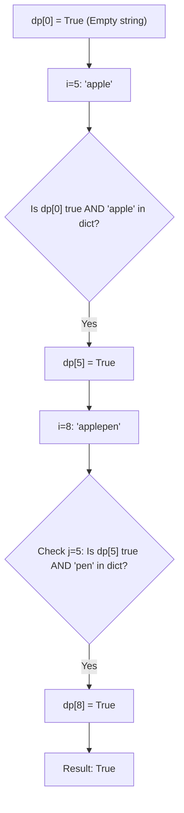

# 🎓 Expert Mentoring: Word Break

The "Word Break" problem is a classic puzzle about **decomposition**. It asks: "Can we build this large object using only the small blocks we have in our toy box?"

---

### 1. Problem Understanding

Imagine you have a long string of letters with no spaces, like `"applepenapple"`. You also have a "dictionary" of allowed words: `["apple", "pen"]`.

**The Goal:** Can you add spaces into that long string so that every single segment is a word from your dictionary?

- **Example 1:** `s = "leetcode"`, `wordDict = ["leet", "code"]`
- Result: **True** (Because "leet" and "code" are both in the dictionary).

- **Example 2:** `s = "catsandog"`, `wordDict = ["cats", "dog", "sand", "and", "cat"]`
- Result: **False** (You can make "cats" + "and", but "og" is left over. Or "cat" + "sand", but "og" is still left over).

---

### 2. Pattern Recognition: Dynamic Programming (The Breadcrumb Trail)

This is a **Decision Problem**. At every point in the string, we need to know: "Is it possible to reach this spot using valid words?"

**The Strategy:**
We use a boolean array `dp` where `dp[i]` is `true` if the prefix of the string (from the start to index ) can be broken into dictionary words.

**The Logic:**
To know if `dp[i]` is true, we look back at all previous positions `j` (where ):

1. Is the part from `0` to `j` valid? (`dp[j] == true`)
2. Is the new part from `j` to `i` a word in our dictionary?

If both are **Yes**, then `dp[i]` becomes `true`!

---

### 3. Visual Explanation

Let's look at `s = "applepen"`, `wordDict = ["apple", "pen"]`.



---

### 4. Step-by-Step Solution

1. **Initialize:** `dp = [true, false, false, ...]` (size `n+1`). `dp[0]` is true because an empty string is always "valid."
2. **Outer Loop (`i`):** Move from the first letter to the end of the string.
3. **Inner Loop (`j`):** For every `i`, look at all possible split points `j` before it.
4. **Check:**

- If `dp[j]` is true (we successfully built the string up to `j` blocks)...
- ...and the substring from `j` to `i` is in our dictionary...
- ...then we can definitely reach `i`! Set `dp[i] = true` and stop checking other `j`s for this `i`.

5. **Return:** `dp[s.length()]`.

---

### 5. Code Implementation (Java)

```java
/**
 * Time Complexity: O(N^3)
 * - N for the outer loop, N for the inner loop, and N for the substring operation.
 * Space Complexity: O(N) - We store a boolean array of size N + 1.
 */
import java.util.*;

class Solution {
    public boolean wordBreak(String s, List<String> wordDict) {
        // Put words in a HashSet for O(1) instant lookup
        Set<String> wordSet = new HashSet<>(wordDict);

        // dp[i] means the substring s[0...i] can be segmented
        boolean[] dp = new boolean[s.length() + 1];

        // Base case: Empty string is valid
        dp[0] = true;

        // Iterate through every end-position i of the string
        for (int i = 1; i <= s.length(); i++) {
            // Check every possible split point j before i
            for (int j = 0; j < i; j++) {
                // If the prefix s[0...j] is valid AND s[j...i] is a dictionary word
                if (dp[j] && wordSet.contains(s.substring(j, i))) {
                    dp[i] = true;
                    // We found a way to reach i, so we can stop checking other j's
                    break;
                }
            }
        }

        return dp[s.length()];
    }
}

```

---

### 6. Complexity Analysis

- **Time Complexity: **
- We have two nested loops (). Inside, we use `s.substring(j, i)`, which in Java takes time (where is the length of the substring). In the worst case, is , leading to .

- **Space Complexity: **
- We store the `dp` array of length . We also store the dictionary in a `HashSet`, which takes space.

---

### 7. Similar Problems

1. **LeetCode 140: Word Break II** (Don't just say if it's possible—return all the actual sentences!).
2. **LeetCode 131: Palindrome Partitioning** (Splitting a string into palindromes instead of dictionary words).
3. **LeetCode 322: Coin Change** (Finding a way to build an amount using "coin" blocks—very similar logic!).

---

### 8. Key Takeaways

- **Prefix Building:** This problem is about building a valid path from the start. If you can't reach point `j`, you can't use it as a springboard to reach point `i`.
- **HashSet for Speed:** Always convert a `List` to a `Set` if you need to perform many `.contains()` checks.
- **DP Table size:** Using `n+1` for the DP table is a common trick to handle the "empty string" base case cleanly.
