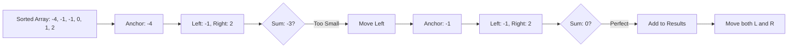

# 🎓 Expert Mentoring: 3Sum

The "3Sum" problem is the older, more complex sibling of the "Two Sum" problem. It’s a perfect way to learn how to manage multiple "pointers" to explore a list of numbers without getting lost.

---

### 1. Problem Understanding

Imagine you are at a large party where everyone has a number on their shirt. The host says: **"Find every unique group of three people whose numbers add up to exactly zero."**

- **Example:** `nums = [-1, 0, 1, 2, -1, -4]`
- **The Goal:** Find triplets like `[-1, -1, 2]` and `[-1, 0, 1]`.
- **The Catch:** You cannot use the same person twice for one triplet, and you shouldn't report the same group of numbers more than once (e.g., `[-1, 0, 1]` is the same as `[0, -1, 1]`).

---

### 2. Pattern Recognition: Two Pointers (The Squeeze)

If we tried to check every possible group of three, it would take a very long time (). Instead, we use a smarter strategy:

1. **Sort the List:** This is the "Magic Key." Once the list is sorted, we can use logic to move through it.
2. **Fix One, Squeeze Two:** \* We pick one number as our "anchor."

- For the rest of the list, we place one pointer at the **start** (left) and one at the **end** (right).
- If the sum is too small, move the left pointer to a bigger number.
- If the sum is too big, move the right pointer to a smaller number.

**When to use this:**

- When you need to find combinations of numbers in a list.
- When the problem involves sums or ranges in a sorted array.

---

### 3. Visual Explanation



---

### 4. Step-by-Step Solution

Let's use `nums = [-1, 0, 1, 2, -1, -4]`.

1. **Sort:** `[-4, -1, -1, 0, 1, 2]`
2. **Anchor 1 (i=0, value -4):**

- Left = -1, Right = 2. Sum = -3 (Too small).
- Move Left to -1. Sum = -3 (Too small).
- No more room.

3. **Anchor 2 (i=1, value -1):**

- Left = -1, Right = 2. **Sum = 0!** Keep `[-1, -1, 2]`.
- Move Left/Right. Left = 0, Right = 1. **Sum = 0!** Keep `[-1, 0, 1]`.

4. **Skip Duplicates:** The next number is also `-1`. Since we already used `-1` as an anchor, we skip it to avoid duplicate results!

---

### 5. Code Implementation (Java)

```java
/**
 * Time Complexity: O(N^2) - One loop for the anchor, and a two-pointer search inside.
 * Space Complexity: O(log N) to O(N) - Depending on the sorting implementation.
 */
import java.util.*;

class Solution {
    public List<List<Integer>> threeSum(int[] nums) {
        List<List<Integer>> result = new ArrayList<>();
        // Sorting is crucial for the two-pointer approach to work
        Arrays.sort(nums);

        for (int i = 0; i < nums.length - 2; i++) {
            // Skip the same number to avoid duplicate triplets
            if (i > 0 && nums[i] == nums[i - 1]) continue;

            int left = i + 1;
            int right = nums.length - 1;

            while (left < right) {
                int sum = nums[i] + nums[left] + nums[right];

                if (sum == 0) {
                    result.add(Arrays.asList(nums[i], nums[left], nums[right]));

                    // Move left and right, but skip duplicates
                    while (left < right && nums[left] == nums[left + 1]) left++;
                    while (left < right && nums[right] == nums[right - 1]) right--;

                    left++;
                    right--;
                } else if (sum < 0) {
                    // Sum too small, move toward larger numbers
                    left++;
                } else {
                    // Sum too big, move toward smaller numbers
                    right--;
                }
            }
        }
        return result;
    }
}

```

---

### 6. Complexity Analysis

- **Time Complexity: **
- Sorting takes . Then, the nested loop structure (an anchor loop with a two-pointer search inside) takes . This is much better than the "brute force" way!

- **Space Complexity: or **
- We don't count the space for the output list. The extra space depends on the sorting algorithm used by the language (usually ).

---

### 7. Similar Problems

1. **LeetCode 1: Two Sum** (The foundational version of this problem).
2. **LeetCode 16: 3Sum Closest** (Find the triplet sum closest to a target).
3. **LeetCode 18: 4Sum** (Adding one more loop for four numbers).

---

### 8. Key Takeaways

- **Sort First:** Sorting often simplifies search problems from "random" to "directional."
- **Handle Duplicates:** Always check if the current number is the same as the previous one to avoid duplicate groups.
- **Two Pointers:** When you have a target sum in a sorted array, the "squeeze" method (Left and Right pointers) is almost always the most efficient.
