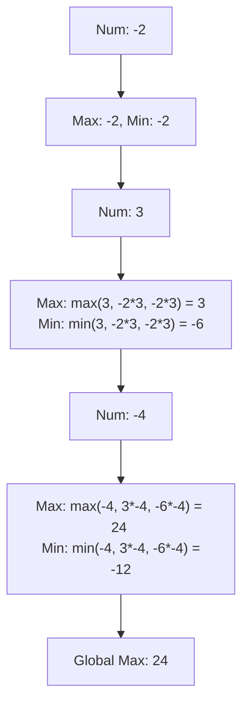

# 🎓 Expert Mentoring: Maximum Product Subarray

While finding the maximum **sum** is straightforward (Kadane's Algorithm), finding the maximum **product** adds a thrilling twist: a very small negative number can suddenly become a very large positive number if you multiply it by another negative!

---

### 1. Problem Understanding

Imagine you are on a treasure hunt. Instead of adding points, you multiply them.

- If you pick a `2` and then a `3`, you have `6`.
- If you then pick a `-10`, you're at `-60` (Oh no!).
- But if you then pick another `-2`, you're suddenly at `+120` (Wow!).

**The Goal:** Find the connected "slice" of numbers that results in the highest product.
**The Challenge:** You have to keep track of the "worst" possible negative number because it might just become your "best" positive number in the next step.

---

### 2. Pattern Recognition: Dynamic Programming (Max & Min Tracking)

This is an evolution of Kadane's Algorithm. Because of the "double negative" rule, we can't just throw away small numbers.

**The Strategy:**
At every step, we keep track of two things:

1. **Current Max:** The biggest product we can make ending at this position.
2. **Current Min:** The smallest (most negative) product we can make ending at this position.

When we meet a new number, we calculate three potential candidates for our new "Max" and "Min":

- The number itself (starting fresh).
- The number times the previous Max.
- The number times the previous Min (because negative negative = positive!).

**When to use this:**

- When finding an optimal product in an array with negative numbers.
- When the "direction" of the optimal value can flip (from min to max).

---

### 3. Visual Explanation



---

### 4. Step-by-Step Solution

Let's use `nums = [2, 3, -2, 4]`

1. **Initialize:** `maxSoFar = 2`, `minSoFar = 2`, `result = 2`.
2. **Number 3:**

- Candidates: `3`, `3*2=6`, `3*2=6`.
- `maxSoFar = 6`, `minSoFar = 3`.
- `result = max(2, 6) = 6`.

3. **Number -2:**

- Candidates: `-2`, `-2*6 = -12`, `-2*3 = -6`.
- `maxSoFar = -2`, `minSoFar = -12`.
- `result = 6`.

4. **Number 4:**

- Candidates: `4`, `4*-2 = -8`, `4*-12 = -48`.
- `maxSoFar = 4`, `minSoFar = -48`.
- `result = 6`.

---

### 5. Code Implementation (Java)

```java
/**
 * Time Complexity: O(N) - One single pass through the array.
 * Space Complexity: O(1) - We only store three variables regardless of array size.
 */
class Solution {
    public int maxProduct(int[] nums) {
        if (nums.length == 0) return 0;

        // Global result to return
        int result = nums[0];
        // The maximum product ending at the current position
        int maxSoFar = nums[0];
        // The minimum product ending at the current position (could become max if multiplied by negative)
        int minSoFar = nums[0];

        for (int i = 1; i < nums.length; i++) {
            int current = nums[i];

            // We store the maxSoFar in a temp variable because it's used to calculate minSoFar
            int tempMax = maxSoFar;

            // Step 1: Find the new max ending at this position
            // It's the max of: the number itself, num * currentMax, or num * currentMin
            maxSoFar = Math.max(current, Math.max(current * maxSoFar, current * minSoFar));

            // Step 2: Find the new min ending at this position
            // It's the min of: the number itself, num * oldMax (temp), or num * currentMin
            minSoFar = Math.min(current, Math.min(current * tempMax, current * minSoFar));

            // Step 3: Update our global winner
            result = Math.max(result, maxSoFar);
        }

        return result;
    }
}

```

---

### 6. Complexity Analysis

- **Time Complexity: **
- We look at each number exactly once. The math inside the loop is simple multiplication and comparison.

- **Space Complexity: **
- No extra arrays. We just keep three integers updated.

---

### 7. Similar Problems

1. **LeetCode 53: Maximum Subarray** (The simpler "sum" version).
2. **LeetCode 121: Best Time to Buy and Sell Stock** (Finding max difference).
3. **LeetCode 628: Maximum Product of Three Numbers** (Finding the largest product using exactly three elements).

---

### 8. Key Takeaways

- **Min is as important as Max:** In multiplication problems, today's "worst" result could be tomorrow's "best" result if you hit a negative sign.
- **Contiguous = Linear Pass:** Whenever you see "contiguous subarray," think of patterns like Kadane’s or Sliding Window that allow you to solve it in .
- **Zeros:** Zeros act as a "reset" point. Both your max and min will become 0, effectively starting the search over for the next element.
