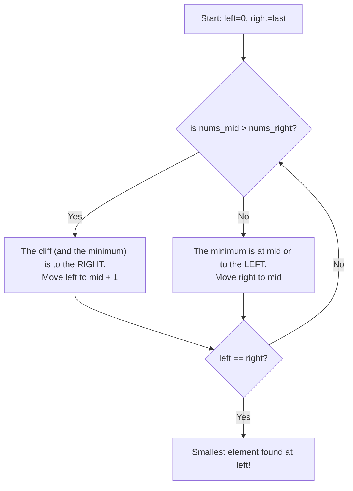

# 🎓 Expert Mentoring: Find Minimum in Rotated Sorted Array

Finding the smallest number in a list sounds easy, but when that list has been "rotated," it becomes a fun puzzle! Let’s break it down using logic and patterns that you can use for hundreds of other coding challenges.

---

### 1. Problem Understanding

Imagine you have a line of friends sorted by height:
`[1, 2, 3, 4, 5]` (Shortest to Tallest)

Now, imagine someone "rotates" the line. They take a group from the back and move them to the front:
`[4, 5, 1, 2, 3]`

**The Goal:** Find the shortest person (the number `1`) in the shortest time possible.

**Rules:**

- The original list was sorted in ascending order.
- The list contains unique numbers (no duplicates).
- You need to find the answer very fast—faster than looking at every single number one by one.

---

### 2. Pattern Recognition: The "Half-and-Half" Trick

Whenever you see a **sorted** (or even a "mostly sorted") array and the goal is to find a specific value in time, your brain should immediately think: **Binary Search.**

**Why Binary Search?**
Think of a phone book. If you’re looking for "Zebra," you don’t start at page 1. You open the middle, see you're at "M," and realize the "Z" section must be in the right half. You just threw away 50% of the work!

In a rotated array, there is a "inflection point" (a cliff) where the numbers suddenly drop from big to small. Binary search helps us find that cliff.

---

### 3. Visual Explanation

Here is how our search window moves. We compare the middle element to the element at the far right.



---

### 4. Step-by-Step Solution

Let's use the example: `[4, 5, 6, 7, 0, 1, 2]`

1. **Initialize:** `left = 0`, `right = 6`.
2. **Middle Check 1:** `mid = 3` (value is `7`).

- Is `7 > 2` (right)? **Yes!**
- This means the "jump" happened somewhere after `7`. The smallest number must be in the right half.
- New `left = 4`.

3. **Middle Check 2:** `left = 4`, `right = 6`, `mid = 5` (value is `1`).

- Is `1 > 2` (right)? **No.**
- This means the right side (`1, 2`) is perfectly sorted. The smallest number could be `1` itself, or something to the left of it.
- New `right = 5`.

4. **Middle Check 3:** `left = 4`, `right = 5`, `mid = 4` (value is `0`).

- Is `0 > 1` (right)? **No.**
- New `right = 4`.

5. **Finish:** Now `left` and `right` both equal `4`. We found it! The value at index 4 is `0`.

---

### 5. Code Implementation (Java)

```java
/**
 * Time Complexity: O(log N) - We cut the search area in half every step.
 * Space Complexity: O(1) - We only use a few integer variables.
 */
class Solution {
    public int findMin(int[] nums) {
        int left = 0;
        int right = nums.length - 1;

        // We use left < right because when they meet,
        // that's our smallest element.
        while (left < right) {
            int mid = left + (right - left) / 2; // Prevents potential overflow

            // If the middle element is greater than the rightmost element,
            // the minimum MUST be in the right part of the array.
            if (nums[mid] > nums[right]) {
                // We do mid + 1 because we know nums[mid]
                // is NOT the minimum (since nums[right] is smaller)
                left = mid + 1;
            }
            // Otherwise, the minimum is either at mid or to the left.
            else {
                // We keep mid as a candidate, so we don't do mid - 1
                right = mid;
            }
        }

        // Both left and right point to the minimum element
        return nums[left];
    }
}

```

---

### 6. Complexity Analysis

- **Time Complexity: **
- If the list has 1,024 elements, we find the answer in about 10 steps. Every time we check a number, we throw away half of the remaining list.

- **Space Complexity: **
- We don't create any new lists or storage. We just move two "pointers" (`left` and `right`) around the existing list.

---

### 7. Similar Problems

Now that you've mastered this, try these similar "Binary Search" puzzles:

1. **LeetCode 33: Search in Rotated Sorted Array** (Find a specific number in this same type of list).
2. **LeetCode 154: Find Minimum in Rotated Sorted Array II** (The same problem, but with duplicate numbers!).
3. **LeetCode 852: Peak Index in a Mountain Array** (Finding the "top" instead of the "bottom").

---

### 8. Key Takeaways

- **Sorted = Binary Search:** Whenever you see "sorted" in a problem description, binary search should be your first thought.
- **The Pivot Point:** In rotated arrays, the relationship between `mid` and `right` (or `left`) tells you which side is "normal" and which side contains the "cliff."
- **Avoid Overlap:** Using `left + (right - left) / 2` is a professional habit to avoid math errors with very large numbers.
- **Shrink the Window:** Logic is just about deciding which half of the list is impossible and throwing it away!
