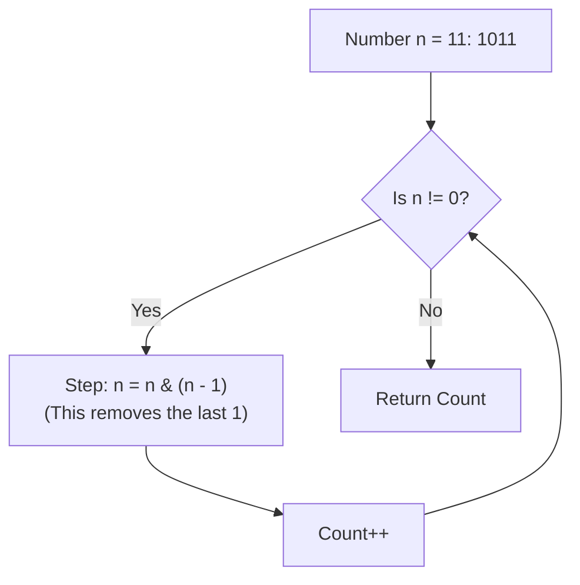

# 🎓 Expert Mentoring: Number of 1 Bits

Computers don't see numbers like "11" or "42"; they see a series of switches that are either **On (1)** or **Off (0)**. This problem is about counting how many "On" switches a number has.

---

### 1. Problem Understanding

Every number can be written in "Binary" (Base-2). For example, the number **11** in our normal world looks like **1011** in the computer world.

- **The Task:** Count how many `1`s are in that binary string.
- **Example:** \* Input: `11` (Binary: `00000000000000000000000000001011`)
- Output: `3` (There are three `1`s).

This is also known as the **Hamming Weight** of a number.

---

### 2. Pattern Recognition: Bit Manipulation

When you work with individual bits (the 0s and 1s), you use a technique called **Bit Manipulation**.

Instead of using division or multiplication, we use "Logic Gates":

1. **AND (`&`):** Tells us if a bit is `1` in both numbers.
2. **Shifting (`>>`):** Slides the bits to the right, like moving people down a conveyor belt so we can look at the one at the very end.

**The Clever Trick (Brian Kernighan’s Algorithm):**
There is a super-fast way to do this. If you do `n & (n - 1)`, it actually flips the **rightmost** `1` to a `0`. Every time we do this, we count it. This is much faster than checking every single zero!

---

### 3. Visual Explanation



---

### 4. Step-by-Step Solution

Let's use the number **11** (Binary `1011`):

1. **Initial:** `n = 1011`, `count = 0`.
2. **Round 1:**

- `n - 1` is `1010`.
- `1011 & 1010` = `1010`. (Notice the last `1` is gone!)
- `count = 1`.

3. **Round 2:**

- `n` is now `1010`.
- `n - 1` is `1001`.
- `1010 & 1001` = `1000`. (Another `1` gone!)
- `count = 2`.

4. **Round 3:**

- `n` is now `1000`.
- `n - 1` is `0111`.
- `1000 & 0111` = `0000`. (The last `1` is gone!)
- `count = 3`.

5. **Finish:** `n` is now `0`, so we stop and return **3**.

---

### 5. Code Implementation (Java)

```java
/**
 * Time Complexity: O(1) in terms of input size (int is always 32 bits),
 * specifically O(M) where M is the number of '1' bits.
 * Space Complexity: O(1) - No extra space used.
 */
public class Solution {
    // We treat n as an unsigned value
    public int hammingWeight(int n) {
        int count = 0;

        // While there are still '1' bits left in the number
        while (n != 0) {
            // Brian Kernighan's Algorithm:
            // This operation effectively turns off the rightmost '1' bit.
            // Example: 1100 & 1011 = 1000
            n = n & (n - 1);

            // Increment the count for the bit we just 'turned off'
            count++;
        }

        return count;
    }
}

```

---

### 6. Complexity Analysis

- **Time Complexity: **
- In Java, an `int` is always 32 bits. Even if the number is huge, the loop runs at most 32 times. Since the number of operations is fixed, we call it . Specifically, using the `n & (n-1)` trick, it only runs as many times as there are `1`s.

- **Space Complexity: **
- We only use one integer variable (`count`) to keep track of our answer.

---

### 7. Similar Problems

1. **LeetCode 190: Reverse Bits** (Rearranging the 0s and 1s).
2. **LeetCode 338: Counting Bits** (Counting 1s for all numbers from 0 to N).
3. **LeetCode 231: Power of Two** (A number is a power of 2 if it has exactly _one_ `1` bit!).

---

### 8. Key Takeaways

- **`n & (n - 1)`:** This is a "magic" formula in bit manipulation to remove the lowest set bit.
- **Bitwise vs. Logical:** Remember that `&` (Bitwise AND) is different from `&&` (Logical AND). We use Bitwise when looking at the "innards" of a number.
- **Efficiency:** Shifting or using bit tricks is often much faster for a computer than doing division or modulo operations.
