# 🎓 Expert Mentoring: House Robber

The "House Robber" problem is a classic introduction to making **optimal choices**. It teaches us how to look at a sequence of decisions and realize that the best choice "now" depends on the best choices we made "then."

---

### 1. Problem Understanding

Imagine you are a professional robber (in a video game!) walking down a street of houses. Each house has a certain amount of money inside.

- **The Catch:** All the houses are connected by a security system. If you rob two **adjacent** (side-by-side) houses on the same night, the alarm will go off and you'll get caught.
- **The Goal:** What is the maximum amount of money you can rob tonight without alerting the police?

**Example:** `nums = [2, 7, 9, 3, 1]`

- If you rob houses 1, 3, and 5: .
- If you rob houses 2 and 4: .
- **Result:** 12 is the winner!

---

### 2. Pattern Recognition: Dynamic Programming (The Choice)

At every house, you face a simple choice:

1. **Rob this house:** If you do, you _cannot_ have robbed the previous house. Your total will be (Current House Money + Max Money from 2 houses ago).
2. **Skip this house:** If you skip it, your total is simply the Max Money you had at the _previous_ house.

**When to use this:**

- When you are making a sequence of decisions.
- When a choice at index restricts your choices at .
- When you need to find a maximum or minimum total.

---

### 3. Visual Explanation

Let's look at the "decision flow" for `[2, 7, 9, 3, 1]`:

```mermaid
graph LR
    A[House 1: $2] --> B["Total: 2"]
    B --> C["House 2: $7"]
    C --> D["Total: max(7, 2) = 7"]
    D --> E["House 3: $9"]
    E --> F["Total: max(9+2, 7) = 11"]
    F --> G["House 4: $3"]
    G --> H["Total: max(3+7, 11) = 11"]
    H --> I["House 5: $1"]
    I --> J["Total: max(1+11, 11) = 12"]

```



---

### 4. Step-by-Step Solution

1. **Base Cases:**

- If there's 0 houses, profit is 0.
- If there's 1 house, rob it!

2. **The DP Table:** Create an array where `dp[i]` stores the max money you can have by the time you reach house `i`.
3. **Filling the Table:**

- `dp[0] = nums[0]`
- `dp[1] = max(nums[0], nums[1])`
- For the rest: `dp[i] = max(nums[i] + dp[i-2], dp[i-1])`

4. **Optimization:** Notice we only ever look back at the last two numbers? We can just use two variables!

---

### 5. Code Implementation (Java)

```java
/**
 * Time Complexity: O(N) - One pass through the houses.
 * Space Complexity: O(1) - We only store the results of the last two houses.
 */
class Solution {
    public int rob(int[] nums) {
        if (nums == null || nums.length == 0) return 0;
        if (nums.length == 1) return nums[0];

        // This represents the max money robbed 2 houses ago
        int prev2 = 0;
        // This represents the max money robbed 1 house ago
        int prev1 = 0;

        for (int money : nums) {
            // Option 1: Rob this house (money + what we had 2 houses ago)
            // Option 2: Skip this house (keep what we had 1 house ago)
            int current = Math.max(money + prev2, prev1);

            // Move our pointers forward
            prev2 = prev1;
            prev1 = current;
        }

        return prev1;
    }
}

```

---

### 6. Complexity Analysis

- **Time Complexity: **
- We walk down the street once. Each house takes exactly one comparison and one addition.

- **Space Complexity: **
- By using `prev1` and `prev2` instead of a full array, we use the same amount of memory whether the street has 5 houses or 5 million.

---

### 7. Similar Problems

1. **LeetCode 213: House Robber II** (The houses are in a circle! If you rob the first, you can't rob the last).
2. **LeetCode 746: Min Cost Climbing Stairs** (A similar "take or skip" logic with costs).
3. **LeetCode 337: House Robber III** (The houses are arranged in a Tree structure—very fun!).

---

### 8. Key Takeaways

- **State Transition:** The core of DP is the formula: `dp[i] = max(rob, skip)`.
- **Space Optimization:** If your calculation only needs the last values, you only need variables.
- **Base Case Logic:** Always handle the "1 house" or "empty array" cases first to avoid errors.
