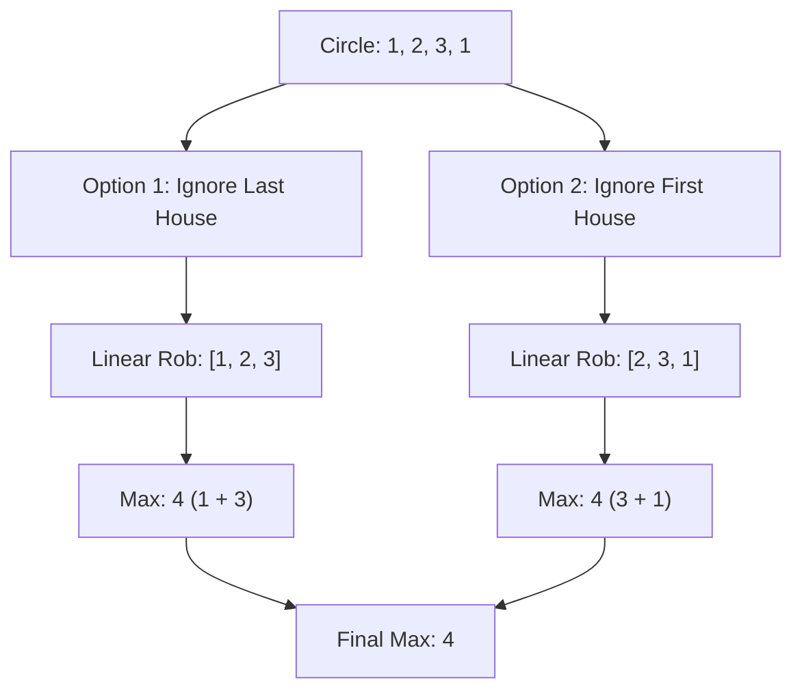

# 🎓 Expert Mentoring: House Robber II

Now that you've mastered the basic "House Robber," it's time for the sequel! This problem introduces a classic trick in algorithmic thinking: **breaking a circular problem into linear sub-problems.**

---

### 1. Problem Understanding

Imagine the same street of houses, but now the street is a **circle**. The first house and the last house are now neighbors!

- **The New Rule:** If you rob the first house, you **cannot** rob the last house.
- **The Goal:** Find the maximum money you can rob without alerting the security system.
- **Example:** `nums = [2, 3, 2]`
- If you rob house 1 ($2), you can't rob house 2 ($3) or house 3 ($2). Total: $2.
- If you rob house 2 ($3), you can't rob house 1 or 3. Total: $3.
- **Result:** 3.

---

### 2. Pattern Recognition: Case Decomposition

When a problem is circular, it usually means the "first" and "last" elements have a special dependency. The easiest way to handle this is to turn one circular problem into **two linear problems**.

**The Strategy:**
Since we can't rob both the first and the last house, we have two simple scenarios:

1. **Case A:** We ignore the last house and rob only from the range `[0 to n-2]`.
2. **Case B:** We ignore the first house and rob only from the range `[1 to n-1]`.

The answer is simply the **maximum** of these two scenarios!

**When to use this:**

- Anytime you have a "circular" constraint (e.g., circular arrays, circular queues).
- When the only thing making the problem hard is the connection between the start and the end.

---

### 3. Visual Explanation

For `nums = [1, 2, 3, 1]`:



---

### 4. Step-by-Step Solution

1. **Base Cases:** If there is only 1 house, just rob it.
2. **Reuse Logic:** Use the exact same function we wrote for "House Robber I" (the linear version).
3. **Run Twice:**

- Call the function for `nums` from index `0` to `length - 2`.
- Call the function for `nums` from index `1` to `length - 1`.

4. **Compare:** Return the larger of the two results.

---

### 5. Code Implementation (Java)

```java
/**
 * Time Complexity: O(N) - We run the linear rob logic twice, which is 2 * N.
 * Space Complexity: O(1) - We use the space-optimized linear rob logic.
 */
class Solution {
    public int rob(int[] nums) {
        if (nums == null || nums.length == 0) return 0;
        if (nums.length == 1) return nums[0];

        // The result is the max of:
        // 1. Robbing houses 0 to n-2 (Ignoring the last house)
        // 2. Robbing houses 1 to n-1 (Ignoring the first house)
        return Math.max(linearRob(nums, 0, nums.length - 2),
                        linearRob(nums, 1, nums.length - 1));
    }

    // This is our helper function from House Robber I
    private int linearRob(int[] nums, int start, int end) {
        int prev2 = 0;
        int prev1 = 0;

        for (int i = start; i <= end; i++) {
            // Decision: Rob current house + 2-ago OR keep 1-ago
            int current = Math.max(nums[i] + prev2, prev1);
            prev2 = prev1;
            prev1 = current;
        }

        return prev1;
    }
}

```

---

### 6. Complexity Analysis

- **Time Complexity: **
- We traverse the houses twice (once for each sub-range). still simplifies to .

- **Space Complexity: **
- We don't use any extra arrays. We only use a few variables to track the "previous" values.

---

### 7. Similar Problems

1. **LeetCode 198: House Robber** (The linear foundation).
2. **LeetCode 918: Maximum Sum Circular Subarray** (Another circular problem that can be split into linear cases).
3. **LeetCode 337: House Robber III** (Robbing houses arranged in a binary tree).

---

### 8. Key Takeaways

- **Circle = Linear + 1 Constraint:** A circular array is just a linear array where you add one "either/or" choice between the ends.
- **Modular Code:** By writing the `linearRob` logic as a helper function, the main solution becomes very clean and easy to read.
- **Strategic Ignoring:** Don't try to solve the circularity inside the DP loop; solve it by changing the input range to the DP.
