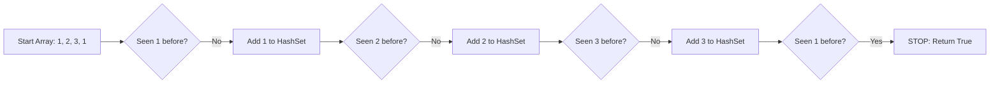

# 🎓 Expert Mentoring: Contains Duplicate

Identifying repeating elements is one of the most fundamental tasks in computer science. Let’s learn how to solve this efficiently and, more importantly, learn the "Memory vs. Time" trade-off.

---

### 1. Problem Understanding

Imagine you are a teacher checking attendance. You have a list of names written on a piece of paper. You want to know: **"Did I write anyone's name down more than once?"**

- **Example A:** `[1, 2, 3, 1]` → **True** (The number `1` appears twice).
- **Example B:** `[1, 2, 3, 4]` → **False** (Every number is unique).

Your goal is to return `true` if any value appears at least twice, and `false` if every element is distinct.

---

### 2. Pattern Recognition: The "Frequency Counter" or "Registry"

This problem introduces a powerful pattern: **Using a Hash-based Data Structure.**

When you need to keep track of things you've seen before, you have two main options:

1. **The Naive Way (Nested Loops):** Compare every number with every other number. This is slow—like looking through the whole list again for every single name.
2. **The Sorted Way:** Sort the list first (`[1, 1, 2, 3]`). Now, duplicates will be side-by-side.
3. **The Fast Way (HashSet):** Use a "mental bucket" (a HashSet). As you walk through the list, you check: "Is this number already in my bucket?" If yes, you found a duplicate!

**When to use a HashSet:**

- When you need to "remember" items you've already processed.
- When you need to check for existence in "Instant Time" ().

---

### 3. Visual Explanation



---

### 4. Step-by-Step Solution

Let's use the list: `[1, 5, 2, 5]`

1. **Create an empty "Seen" list (HashSet).**
2. **Look at the first number: `1`.** Is it in "Seen"? No. Add it.

- _Seen: {1}_

3. **Look at the second number: `5`.** Is it in "Seen"? No. Add it.

- _Seen: {1, 5}_

4. **Look at the third number: `2`.** Is it in "Seen"? No. Add it.

- _Seen: {1, 5, 2}_

5. **Look at the fourth number: `5`.** Is it in "Seen"? **YES!**

- Since we've seen `5` before, we immediately stop and say **True**.

---

### 5. Code Implementation (Java)

```java
/**
 * Time Complexity: O(N) - We travel through the list exactly once.
 * Space Complexity: O(N) - In the worst case, we store every number in the HashSet.
 */
import java.util.HashSet;

class Solution {
    public boolean containsDuplicate(int[] nums) {
        // Create a HashSet to store the numbers we've encountered
        // A HashSet is perfect because it provides O(1) average time for searches
        HashSet<Integer> seen = new HashSet<>();

        for (int num : nums) {
            // .add() returns false if the element is already present in the set
            if (!seen.add(num)) {
                // If add() fails, it means we've seen this number before!
                return true;
            }
        }

        // If we finish the loop, no duplicates were found
        return false;
    }
}

```

---

### 6. Complexity Analysis

- **Time Complexity: **
- We only walk through the array one time. If there are 1,000,000 numbers, we perform roughly 1,000,000 checks. This is very efficient!

- **Space Complexity: **
- This is the trade-off. To be fast, we need "memory." In the worst case (where there are no duplicates), we end up storing all numbers in our HashSet.

---

### 7. Similar Problems

Now that you know how to use a `HashSet` to remember things, try these:

1. **LeetCode 1: Two Sum** (Use a Map to remember "complimentary" numbers you've seen).
2. **LeetCode 387: First Unique Character in a String** (Count how many times you see each letter).
3. **LeetCode 448: Find All Numbers Disappeared in an Array** (Another variation of tracking what is present).

---

### 8. Key Takeaways

- **HashSets for Existence:** If the question asks "Have we seen this before?", a `HashSet` is usually the answer.
- **Early Exit:** You don't always have to check the whole list. As soon as you find one duplicate, you can stop (return `true`).
- **Trading Space for Time:** We use extra memory ( space) to make the algorithm much faster ( time) compared to a naive approach.
