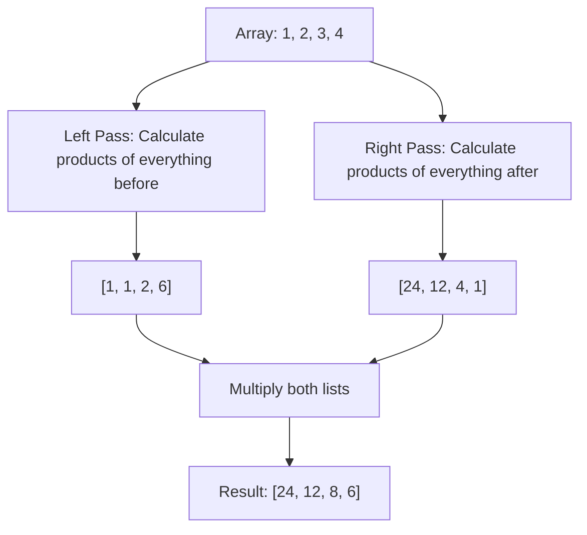

# 🎓 Expert Mentoring: Product of Array Except Self

This is a clever puzzle that challenges you to find a solution without using a specific tool—in this case, **division**. It teaches us how to use "pre-calculation" to solve complex problems in a single pass.

---

### 1. Problem Understanding

Imagine you have a row of boxes, each containing a number. For every box, you want to calculate the product of **all the other numbers** in the row, except for the one in the current box.

- **The Rule:** You are **not allowed** to use division. (If we could, we would just multiply everything once and divide by the current number, but that's "cheating" for this problem!)
- **Example:** `nums = [1, 2, 3, 4]`
- For index 0:
- For index 1:
- For index 2:
- For index 3:

- **Result:** `[24, 12, 8, 6]`

---

### 2. Pattern Recognition: Prefix and Suffix Products

If you can't use division, how do you get the product of everything else?
Every "everything else" is actually made of two parts:

1. Everything to the **Left** of the number (Prefix).
2. Everything to the **Right** of the number (Suffix).

If we multiply the (Product of everything on the left) by the (Product of everything on the right), we get our answer!

**When to use this:**

- When you need to calculate a value based on the entire context of an array except for the current element.
- When you want to optimize nested loops into linear time.

---

### 3. Visual Explanation



---

### 4. Step-by-Step Solution

Let's use `nums = [1, 2, 3, 4]`.

1. **Left Pass (Prefix):** Start with a `runningProduct = 1`.

- Index 0: `1` (nothing to the left). Update `runningProduct = 1 * 1 = 1`.
- Index 1: `1` (1 is to the left). Update `runningProduct = 1 * 2 = 2`.
- Index 2: `2` (1 and 2 are to the left). Update `runningProduct = 2 * 3 = 6`.
- Index 3: `6` (1, 2, and 3 are to the left).
- Result so far: `[1, 1, 2, 6]`

2. **Right Pass (Suffix):** Start with `runningProduct = 1` and move **backwards**.

- Index 3: Current `6` _ `1` = `6`. Update `runningProduct = 1 _ 4 = 4`.
- Index 2: Current `2` _ `4` = `8`. Update `runningProduct = 4 _ 3 = 12`.
- Index 1: Current `1` _ `12` = `12`. Update `runningProduct = 12 _ 2 = 24`.
- Index 0: Current `1` \* `24` = `24`.

3. **Final Result:** `[24, 12, 8, 6]`.

---

### 5. Code Implementation (Java)

```java
/**
 * Time Complexity: O(N) - We pass through the array twice (left-to-right, then right-to-left).
 * Space Complexity: O(1) - We use the output array to store results, so no extra space is used.
 */
class Solution {
    public int[] productExceptSelf(int[] nums) {
        int length = nums.length;
        int[] result = new int[length];

        // 1. Left-to-Right Pass
        // We calculate the product of all elements to the left of index 'i'
        result[0] = 1; // Nothing is to the left of the first element
        for (int i = 1; i < length; i++) {
            // The left product for 'i' is the left product for 'i-1'
            // multiplied by the actual number at 'i-1'
            result[i] = result[i - 1] * nums[i - 1];
        }

        // 2. Right-to-Left Pass
        // We use a single variable to keep track of products from the right
        int rightProduct = 1;
        for (int i = length - 1; i >= 0; i--) {
            // Multiply the existing left product (stored in result)
            // by the product of everything to the right
            result[i] = result[i] * rightProduct;

            // Update the running right product for the next element
            rightProduct *= nums[i];
        }

        return result;
    }
}

```

---

### 6. Complexity Analysis

- **Time Complexity: **
- We walk forward once and backward once. Two passes mean operations, which is still .

- **Space Complexity: **
- Since the problem says the output array doesn't count as extra space, and we only used one extra integer (`rightProduct`), our space usage is constant!

---

### 7. Similar Problems

1. **LeetCode 42: Trapping Rain Water** (Uses similar logic of "What is the max to my left?" and "What is the max to my right?").
2. **LeetCode 53: Maximum Subarray** (Another linear time array problem).
3. **LeetCode 560: Subarray Sum Equals K** (Uses a "Prefix Sum" technique, which is the addition version of this).

---

### 8. Key Takeaways

- **Two-Pass Strategy:** If you can't solve a problem looking one way, try looking from both ends.
- **Division-Free:** This pattern is essential for cases where the array might contain zeros (where division would cause an error).
- **Space Optimization:** You can often reuse your output array to store intermediate results to keep your space complexity low.
