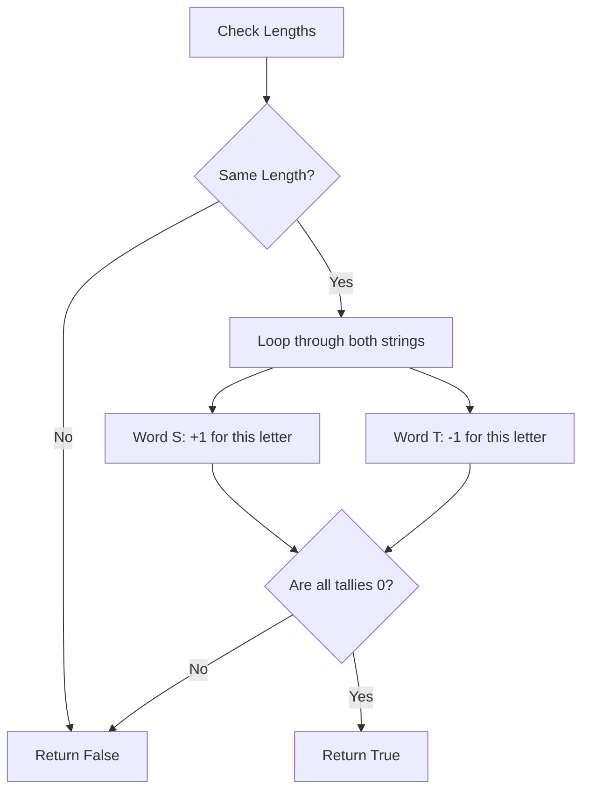

# 🎓 Expert Mentoring: Valid Anagram

An anagram is like a word puzzle where you rearrange the letters of one word to make a new one. Today, we’ll learn how to tell if two words are "letter-twins" using a very popular computer science pattern.

---

### 1. Problem Understanding

Imagine you have two bags of plastic alphabet letters. You want to know if you can build the second word using **exactly** the letters from the first word—no letters left over, and no extra letters needed.

- **Example A:** `s = "anagram"`, `t = "nagaram"`
- Both have 3 'a's, 1 'g', 1 'm', 1 'n', and 1 'r'.
- **Result: True** ✅

- **Example B:** `s = "rat"`, `t = "car"`
- "rat" has a 't', but "car" doesn't. "car" has a 'c', but "rat" doesn't.
- **Result: False** ❌

---

### 2. Pattern Recognition: Frequency Counting (The Tally Sheet)

This problem is a classic candidate for the **Frequency Counter** pattern.

**The Concept:**
Instead of trying every possible way to rearrange the letters (which would take forever!), we just count them. Think of it like a grocery list:

- Word 1: 3 Apples, 1 Banana.
- Word 2: 3 Apples, 1 Banana.
- If the lists match, they are anagrams!

**When to use this:**

- When comparing two sets of data (strings, arrays, etc.).
- When the **order** doesn't matter, but the **quantity** of each item does.

---

### 3. Visual Explanation

We use a "Tally Array" of size 26 (one slot for each letter from 'a' to 'z').



---

### 4. Step-by-Step Solution

Let's use `s = "anagram"` and `t = "nagaram"`:

1. **Length Check:** Both are 7 letters long. Proceed!
2. **The Tally Board:** Create an array of 26 zeros.
3. **The Processing Loop:**

- For `s`, we see 'a'. Increment `alphabet[0]` to 1.
- For `t`, we see 'n'. Decrement `alphabet[13]` to -1.
- ... repeat for all letters.

4. **The Balancing Act:** Because both words have the exact same letters, every "+1" from word `s` will eventually be cancelled out by a "-1" from word `t`.
5. **Final Check:** Look at the Tally Board. If every single slot is `0`, they are anagrams!

---

### 5. Code Implementation (Java)

```java
/**
 * Time Complexity: O(N) - We traverse the strings once.
 * Space Complexity: O(1) - The counter array is always size 26, regardless of input size.
 */
class Solution {
    public boolean isAnagram(String s, String t) {
        // If lengths are different, they can't be anagrams
        if (s.length() != t.length()) {
            return false;
        }

        // Create a tally board for the 26 lowercase English letters
        int[] charCounts = new int[26];

        for (int i = 0; i < s.length(); i++) {
            // Increment for string s
            // 'a' - 'a' = 0, 'b' - 'a' = 1, etc. This maps letters to 0-25
            charCounts[s.charAt(i) - 'a']++;

            // Decrement for string t
            charCounts[t.charAt(i) - 'a']--;
        }

        // If it's a valid anagram, every position in the array should be 0
        for (int count : charCounts) {
            if (count != 0) {
                return false;
            }
        }

        return true;
    }
}

```

---

### 6. Complexity Analysis

- **Time Complexity: **
- We loop through the strings once () and then loop through the alphabet array (26). Since 26 is a constant, it's just .

- **Space Complexity: ** (Constant Space)
- Wait, we used an array! But because that array is **always** size 26 (it doesn't grow if the words get longer), we call this "constant space."

---

### 7. Similar Problems

Now that you've mastered the Tally Sheet, try these:

1. **LeetCode 383: Ransom Note** (Can you build a note using letters from a magazine?)
2. **LeetCode 49: Group Anagrams** (A harder version where you group many anagrams together).
3. **LeetCode 387: First Unique Character in a String** (Find which letter has a count of exactly 1).

---

### 8. Key Takeaways

- **Mapping Characters:** `char - 'a'` is a pro-tip to turn letters into array indexes (0-25).
- **Balance is Key:** Incrementing for one side and decrementing for the other is a clean way to check for equality without needing two separate frequency maps.
- **Constraints Matter:** This solution works for lowercase English letters. If the problem included emojis or symbols, we would use a `HashMap` instead of a fixed array.
