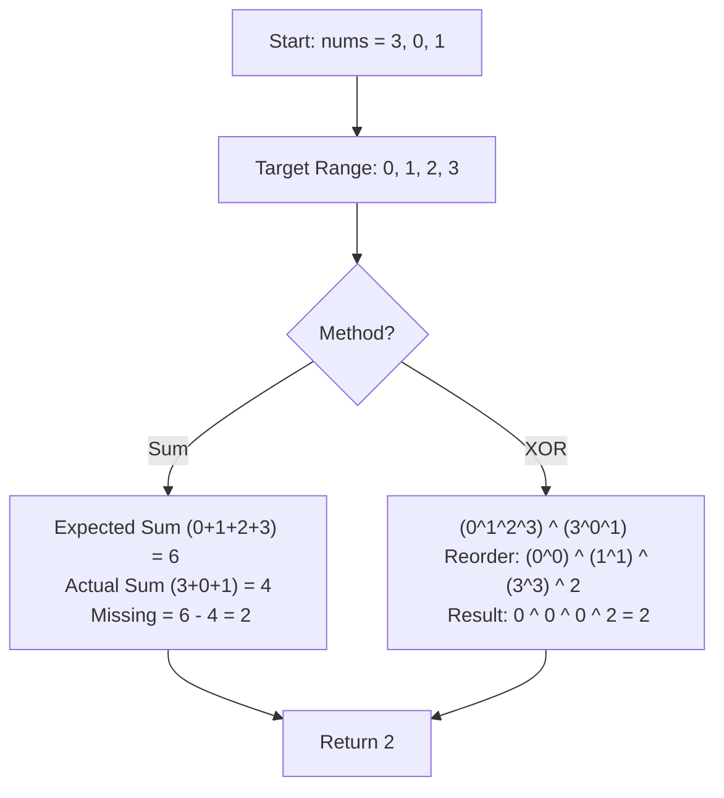

# 🎓 Expert Mentoring: Missing Number

Finding a missing item in a sequence is a classic problem that can be solved in many ways—some involving math, some involving memory, and one very clever "magic" trick using bits!

---

### 1. Problem Understanding

Imagine you have a set of numbered blocks from to . However, one block is missing from the pile. Your job is to look at the blocks you _do_ have and figure out which one is gone.

- **The Scenario:** You are given an array containing distinct numbers in the range .
- **The Goal:** Return the only number in the range that is missing from the array.
- **Example:** `nums = [3, 0, 1]`
- The range is to (since there are 3 numbers).
- The numbers should be: `0, 1, 2, 3`.
- In our list, `2` is missing. **Result: 2**.

---

### 2. Pattern Recognition: Gauss's Sum vs. The XOR Trick

There are two primary ways to solve this efficiently:

1. **The Mathematician's Way (Summation):** We know exactly what the sum of numbers from to _should_ be using the formula: . If we subtract the sum of the numbers we actually have, the leftover is the missing number.
2. **The Programmer's Way (XOR):**
   There is a special property of **XOR (`^`)**:

- (A number XORed with itself cancels out).
- (A number XORed with zero stays the same).
  If we XOR every number from to with every number in our array, all the pairs will cancel out, leaving only the missing number behind!

**When to use this:**

- When looking for a "lone survivor" or a "missing piece" in a collection.
- When you want to avoid potential "integer overflow" (XOR is safer than Sum for massive numbers).

---

### 3. Visual Explanation



---

### 4. Step-by-Step Solution (The Sum Method)

Let's use `nums = [3, 0, 1]` ().

1. **Calculate Expected Sum:** Using .
2. **Calculate Actual Sum:**
   .
3. **Find the Difference:**
   .
4. **Result:** `2`.

---

### 5. Code Implementation (Java)

```java
/**
 * Time Complexity: O(N) - We iterate through the array once.
 * Space Complexity: O(1) - We only store two integer variables.
 */
class Solution {
    public int missingNumber(int[] nums) {
        int n = nums.length;

        // Gauss Sum Formula: Sum of 0 to n = n * (n + 1) / 2
        int expectedSum = n * (n + 1) / 2;

        int actualSum = 0;
        // Add up all the numbers we actually have
        for (int num : nums) {
            actualSum += num;
        }

        // The difference is the number that didn't make it into the actualSum
        return expectedSum - actualSum;
    }
}

```

---

### 6. Complexity Analysis

- **Time Complexity: **
- We have to look at every number in the array exactly once to calculate the `actualSum`.

- **Space Complexity: **
- We aren't using any extra arrays or lists. We just use two fixed variables regardless of how big the input is.

---

### 7. Similar Problems

1. **LeetCode 136: Single Number** (Use the XOR trick to find the only number that doesn't have a pair).
2. **LeetCode 448: Find All Numbers Disappeared in an Array** (A slightly more complex version with multiple missing numbers).
3. **LeetCode 287: Find the Duplicate Number** (The opposite of this problem—finding the "extra" number).

---

### 8. Key Takeaways

- **Math is a Shortcut:** Knowing simple formulas like Gauss's Sum can turn a search problem into a simple subtraction problem.
- **XOR for Pairs:** Keep the XOR trick in your back pocket—it's the most "computer-sciencey" way to find missing or unique elements.
- **Boundary Awareness:** Remember that for an array of size , the range of numbers is to (inclusive).
