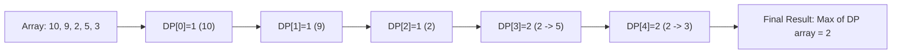

# 🎓 Expert Mentoring: Longest Increasing Subsequence (LIS)

The Longest Increasing Subsequence problem is a classic challenge that tests your ability to see the "path" within a jumble of numbers. It's a perfect example of how **Dynamic Programming** can turn a complex search into a structured calculation.

---

### 1. Problem Understanding

Imagine you are watching a parade of people of different heights. You want to pick out a group of people to stand in a line, but there are two rules:

1. They must stay in the **same relative order** they appeared in the parade (you can skip people, but you can't move someone from the back to the front).
2. Each person you pick must be **taller** than the person before them.

**The Goal:** What is the maximum number of people you can pick for this line?

**Example:** `nums = [10, 9, 2, 5, 3, 7, 101, 18]`

- One subsequence: `[2, 3, 7, 18]` (Length 4)
- Another: `[2, 5, 7, 101]` (Length 4)
- The result is **4**.

---

### 2. Pattern Recognition: Dynamic Programming

This problem has "Optimal Substructure." This means the best answer for a list of 10 numbers depends on the best answers we found for the first 9 numbers.

**The Strategy:**
For every number in the list, we ask: "What is the longest line I can end with **this** number?"
To answer that, we look at all the numbers _before_ it. If a previous number is smaller, we can take the line ending at that number and add our current number to it.

**When to use this:**

- When you need to find a subsequence (not necessarily a continuous "subarray").
- When the decision at the current step depends on the "best" decisions made at multiple previous steps.

---

### 3. Visual Explanation



---

### 4. Step-by-Step Solution

Let's use `nums = [10, 9, 2, 5, 3]`.

1. **Initialize:** Create a `dp` array of the same size, filled with `1` (because every single number is an increasing subsequence of length 1).
   `dp = [1, 1, 1, 1, 1]`
2. **Index 1 (Value 9):** Look back at index 0 (10). Is ? No. `dp[1]` stays `1`.
3. **Index 2 (Value 2):** Look back at 10 and 9. Is ? No. Is ? No. `dp[2]` stays `1`.
4. **Index 3 (Value 5):**

- Look at 10: ? No.
- Look at 9: ? No.
- Look at 2: ? **Yes!**
- Length could be `dp[2] + 1` = .
- `dp[3]` becomes `2`.

5. **Index 4 (Value 3):**

- Look at 10, 9: No.
- Look at 2: **Yes!** Length = `dp[2] + 1 = 2`.
- Look at 5: No.
- `dp[4]` becomes `2`.

6. **Final Result:** The max value in our `dp` array is `2`.

---

### 5. Code Implementation (Java)

```java
/**
 * Time Complexity: O(N^2) - We have a nested loop: for each element, we look back at all previous elements.
 * Space Complexity: O(N) - We use an array of size N to store the longest subsequence length ending at each index.
 */
import java.util.Arrays;

class Solution {
    public int lengthOfLIS(int[] nums) {
        if (nums == null || nums.length == 0) {
            return 0;
        }

        int n = nums.length;
        // dp[i] will store the length of the longest increasing subsequence
        // that ends with the element at index i.
        int[] dp = new int[n];

        // Every element is an increasing subsequence of length 1 by itself
        Arrays.fill(dp, 1);

        int overallMax = 1;

        // Iterate through each element in the array
        for (int i = 1; i < n; i++) {
            // Check all previous elements before the current index i
            for (int j = 0; j < i; j++) {
                // If the current element is greater than the previous element
                if (nums[i] > nums[j]) {
                    // We can potentially extend the subsequence ending at j
                    // dp[i] becomes the max of its current value or (dp[j] + 1)
                    dp[i] = Math.max(dp[i], dp[j] + 1);
                }
            }
            // Keep track of the maximum value found in the dp array so far
            overallMax = Math.max(overallMax, dp[i]);
        }

        return overallMax;
    }
}

```

---

### 6. Complexity Analysis

- **Time Complexity: **
- For an array of 1,000 numbers, we perform roughly 500,000 comparisons (the sum of 1 to ).

- **Space Complexity: **
- we store one integer for every number in the input array to keep track of our "best so far."

---

### 7. Similar Problems

1. **LeetCode 322: Coin Change** (Uses DP to build an optimal solution from previous values).
2. **LeetCode 673: Number of Longest Increasing Subsequence** (A step further—counting _how many_ different paths give the same max length).
3. **LeetCode 354: Russian Doll Envelopes** (A 2D version of LIS where you fit envelopes inside each other).

---

### 8. Key Takeaways

- **The "Look Back" Rule:** In DP, if you're at index , your answer is usually built by looking at all that satisfy a specific condition.
- **Initialization Matters:** Start your DP array with `1` because the smallest possible subsequence is just the number itself.
- **Optimization:** While is the standard DP way, there is a very clever way using **Binary Search**. It's harder to understand, but much faster for huge lists!
