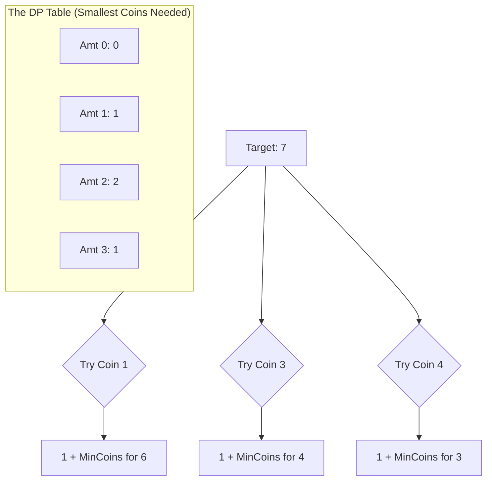

# 🎓 Expert Mentoring: Coin Change

The "Coin Change" problem is a classic puzzle that teaches us why "Greedy" thinking doesn't always work and how **Dynamic Programming** can find the perfect solution by looking at all possibilities efficiently.

---

### 1. Problem Understanding

Imagine you are at a self-checkout machine. You need to pay exactly \***\* cents. You have an unlimited supply of coins worth **1, 2, and 5\*\* cents.

**The Goal:** What is the **fewest** number of coins you can use to make exactly 11 cents?

- **Wait! Why isn't it simple?**
  If you just grab the biggest coins first (Greedy): 5 + 5 + 1 = **3 coins**.
  In this case, Greedy works. But what if your coins were **1, 3, and 4** and you needed **6**?
- Greedy: 4 + 1 + 1 = **3 coins**.
- Smarter: 3 + 3 = **2 coins**!

This is why we need to check every amount from 1 up to our target.

---

### 2. Pattern Recognition: Dynamic Programming (Bottom-Up)

We use **Dynamic Programming (DP)** because the answer for 11 cents depends on the answers for smaller amounts (like 10, 9, or 6 cents).

**The Strategy:**
We build a table. For every amount from to our `target`, we ask: "If I take one coin of value , how many coins did it take to make the remaining amount?"

**When to use this:**

- When you need to find an **optimal** (min/max) way to reach a total.
- When you can reuse the results of smaller sub-problems.

---

### 3. Visual Explanation



---

### 4. Step-by-Step Solution

Let's use `coins = [1, 2, 5]` and `amount = 5`.

1. **Initialize:** Create a DP array of size 6 (0 to 5). Fill it with a "Big Number" (Infinity) because we haven't found a solution yet.
   `dp[0] = 0` (It takes zero coins to make zero cents).
2. **Amount 1:** Can we use a 1-cent coin? Yes. `1 + dp[1-1]` = .
3. **Amount 2:** \* Use 1-cent: `1 + dp[2-1]` = .

- Use 2-cent: `1 + dp[2-2]` = . (1 is smaller, so `dp[2]=1`).

4. **Amount 3:**

- Use 1-cent: `1 + dp[2]` = 2.
- Use 2-cent: `1 + dp[1]` = 2.
- Result: `dp[3]=2`.

5. **Amount 5:**

- Use 1-cent: `1 + dp[4]` = 3.
- Use 2-cent: `1 + dp[3]` = 3.
- Use 5-cent: `1 + dp[0]` = **1**.

6. **Final Result:** `dp[5] = 1`.

---

### 5. Code Implementation (Java)

```java
/**
 * Time Complexity: O(amount * n) - We visit every amount up to 'amount'
 * and for each, we check 'n' types of coins.
 * Space Complexity: O(amount) - We store a table for every amount up to the target.
 */
import java.util.Arrays;

class Solution {
    public int coinChange(int[] coins, int amount) {
        // Create a table to store the min coins for every amount from 0 to amount
        int[] dp = new int[amount + 1];

        // Fill the table with a value larger than any possible answer
        // amount + 1 is safe because the most coins we could ever use is all 1-cent coins.
        Arrays.fill(dp, amount + 1);

        // Base case: To make 0 cents, you need 0 coins
        dp[0] = 0;

        // Iterate through every amount from 1 to the target
        for (int i = 1; i <= amount; i++) {
            // For each amount, try every coin available
            for (int coin : coins) {
                // If the coin is not bigger than the amount we are currently building
                if (i - coin >= 0) {
                    // The answer is the minimum of:
                    // 1. What we already found for this amount
                    // 2. 1 (the current coin) + min coins for the remaining amount
                    dp[i] = Math.min(dp[i], 1 + dp[i - coin]);
                }
            }
        }

        // If dp[amount] is still the big number, it means we couldn't make that amount
        return dp[amount] > amount ? -1 : dp[amount];
    }
}

```

---

### 6. Complexity Analysis

- **Time Complexity: **
- is the amount, is the number of coins. We have a loop inside a loop. If you need to make 100 cents with 3 types of coins, you do roughly 300 checks.

- **Space Complexity: **
- We create one array that is as long as the amount we are trying to reach.

---

### 7. Similar Problems

1. **LeetCode 300: Longest Increasing Subsequence** (Uses a similar DP table approach).
2. **LeetCode 518: Coin Change II** (Instead of the _fewest_ coins, find the total _number of ways_ to make the change).
3. **LeetCode 279: Perfect Squares** (The exact same logic, but the "coins" are square numbers like 1, 4, 9...).

---

### 8. Key Takeaways

- **Bottom-Up Power:** By solving for 1, 2, and 3 cents first, the "hard" problem of 100 cents becomes easy because the answers are already waiting in the table.
- **Max Value Init:** We initialize with `amount + 1` (or `Infinity`) so that the very first valid combination we find will be smaller and trigger the `Math.min` update.
- **No Solution:** Always handle the case where the amount is impossible (like making 3 cents using only 2-cent coins) by checking if your DP value ever changed from the initial "Big Number."
