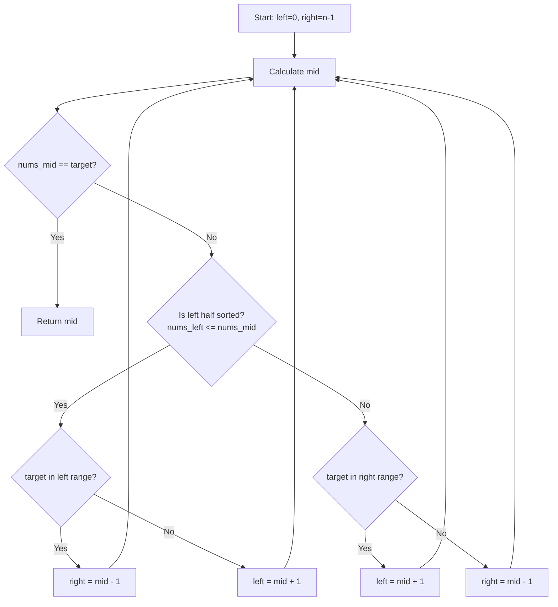

# 🎓 Expert Mentoring: Search in Rotated Sorted Array

Searching for a number in a sorted list is easy, but what if that list has been "broken" and rearranged? This problem is the ultimate test of your understanding of **Binary Search**.

---

### 1. Problem Understanding

Imagine you have a deck of cards numbered `1` to `7` in order: `[1, 2, 3, 4, 5, 6, 7]`.

Now, you "cut" the deck somewhere in the middle and move the bottom half to the top. Your deck might now look like this: `[4, 5, 6, 7, 1, 2, 3]`.

**The Goal:** Someone picks a number (the **target**) and asks you to find exactly where it is in that "cut" deck as quickly as possible.

- **Example:** `nums = [4, 5, 6, 7, 0, 1, 2]`, `target = 0`
- **Result:** `4` (because `0` is at index 4).
- **If it's not there:** Return `-1`.

---

### 2. Pattern Recognition: Modified Binary Search

Usually, Binary Search only works on perfectly sorted lists. However, a rotated sorted array has a special property: **At least one half of the array is always sorted.**

**The Logic:**

1. Look at the middle.
2. Identify which side (left or right) is "normal" (perfectly sorted).
3. Check if the `target` falls within the range of that sorted side.
4. If it does, search there. If not, the target _must_ be in the other (messy) side.

**When to use this:**

- Anytime you are searching in a "rotated" or "shifted" sorted structure.
- When the requirement is time complexity.

---

### 3. Visual Explanation



---

### 4. Step-by-Step Solution

Let's use: `nums = [4, 5, 6, 7, 0, 1, 2]`, `target = 0`.

1. **Start:** `left = 0`, `right = 6`. `mid = 3` (Value = `7`).
2. **Is mid the target?** No (`7 != 0`).
3. **Which side is sorted?** \* Compare `nums[left]` (4) and `nums[mid]` (7).

- Since `4 <= 7`, the **left side is sorted** (`4, 5, 6, 7`).

4. **Is the target in the sorted side?**

- Is `0` between `4` and `7`? **No.**
- So, we "throw away" the left side. New `left = mid + 1` (index 4).

5. **Next Step:** `left = 4`, `right = 6`. `mid = 5` (Value = `1`).
6. **Is mid the target?** No (`1 != 0`).
7. **Which side is sorted?**

- Compare `nums[left]` (0) and `nums[mid]` (1).
- Since `0 <= 1`, the **left side is sorted**.

8. **Is the target in the sorted side?**

- Is `0` between `0` and `1`? **Yes!**
- So, we "throw away" the right side. New `right = mid - 1` (index 4).

9. **Next Step:** `left = 4`, `right = 4`. `mid = 4` (Value = `0`).
10. **Match!** Return `4`.

---

### 5. Code Implementation (Java)

```java
/**
 * Time Complexity: O(log N) - We divide the search space by half each time.
 * Space Complexity: O(1) - We only use a few integer pointers.
 */
class Solution {
    public int search(int[] nums, int target) {
        int left = 0;
        int right = nums.length - 1;

        while (left <= right) {
            int mid = left + (right - left) / 2; // Find the middle

            if (nums[mid] == target) {
                return mid; // Found it!
            }

            // Identify which half is sorted
            // If left to mid is sorted
            if (nums[left] <= nums[mid]) {
                // Check if the target is within this sorted range
                if (target >= nums[left] && target < nums[mid]) {
                    right = mid - 1; // Target is in the left half
                } else {
                    left = mid + 1;  // Target must be in the right half
                }
            }
            // Otherwise, mid to right must be sorted
            else {
                // Check if target is within this sorted range
                if (target > nums[mid] && target <= nums[right]) {
                    left = mid + 1;  // Target is in the right half
                } else {
                    right = mid - 1; // Target must be in the left half
                }
            }
        }

        return -1; // Target not found
    }
}

```

---

### 6. Complexity Analysis

- **Time Complexity: **
- Even though the array is rotated, we still eliminate half of the remaining elements in every step of the loop. This is the hallmark of Binary Search.

- **Space Complexity: **
- We don't create any extra lists or storage. We just move `left`, `right`, and `mid` markers.

---

### 7. Similar Problems

1. **LeetCode 153: Find Minimum in Rotated Sorted Array** (Find the "cliff" where the rotation happened).
2. **LeetCode 81: Search in Rotated Sorted Array II** (The same problem but where numbers can repeat—this makes it trickier!).
3. **LeetCode 162: Find Peak Element** (Another clever use of Binary Search on "unsorted-looking" data).

---

### 8. Key Takeaways

- **The Golden Rule of Binary Search:** You don't need a fully sorted list; you just need a way to **consistently eliminate half** of the search space.
- **Sorted Half Strategy:** In a rotated array, one half is _always_ sorted. Use that sorted half as your anchor to decide where to go next.
- **Boundary Checks:** Always be careful with `<=` vs `<` to ensure you don't miss the target when it's sitting exactly on the `left`, `right`, or `mid` pointer.
