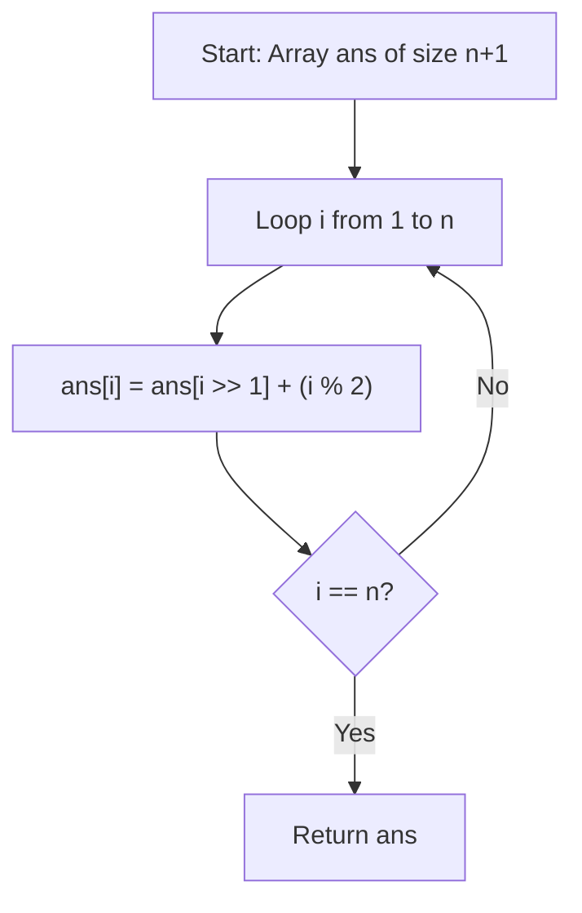

# 🎓 Expert Mentoring: Counting Bits

Building on what we learned about counting a single number's bits, this problem asks us to do it for a whole range of numbers. While we _could_ just repeat the previous trick, there is a much more elegant way to do this using **Dynamic Programming**.

---

### 1. Problem Understanding

Imagine you are building a staircase of numbers from up to . For each step, you want to write down how many "On" switches (1s) that number has in its binary form.

- **Input:** `n = 5`
- **The Task:** Count bits for `0, 1, 2, 3, 4, 5`.
- 0: `0` (0 bits)
- 1: `1` (1 bit)
- 2: `10` (1 bit)
- 3: `11` (2 bits)
- 4: `100` (1 bit)
- 5: `101` (2 bits)

- **Output:** `[0, 1, 1, 2, 1, 2]`

---

### 2. Pattern Recognition: Dynamic Programming (The "Already Solved" Trick)

If we look closely, the number of bits in a number is usually related to a smaller number we've already seen. This is the heart of **Dynamic Programming (DP)**.

**The Pattern:**
Consider the number `13` (Binary: `1101`).
If we "shift" it right by one (dropping the last bit), it becomes `6` (Binary: `110`).

- The bits in `13` = (Bits in `6`) + (The bit we dropped).
- If the number is even, the dropped bit was `0`.
- If the number is odd, the dropped bit was `1`.

**When to use this:**

- When you need to compute a sequence where each result depends on previous results.
- When you want to avoid redundant calculations ( instead of ).

---

### 3. Visual Explanation



---

### 4. Step-by-Step Solution

Let's calculate for `n = 4`:

1. **Initialize:** `ans = [0, 0, 0, 0, 0]` (Base case: 0 has 0 bits).
2. **i = 1:** \* `1 >> 1` is `0`.

- `ans[1] = ans[0] + (1 % 2)` = .

3. **i = 2:** \* `2 >> 1` is `1`.

- `ans[2] = ans[1] + (2 % 2)` = .

4. **i = 3:** \* `3 >> 1` is `1`.

- `ans[3] = ans[1] + (3 % 2)` = .

5. **i = 4:** \* `4 >> 1` is `2`.

- `ans[4] = ans[2] + (4 % 2)` = .

Result: `[0, 1, 1, 2, 1]`

---

### 5. Code Implementation (Java)

```java
/**
 * Time Complexity: O(N) - We calculate each number's bits exactly once.
 * Space Complexity: O(1) - If we don't count the output array.
 */
class Solution {
    public int[] countBits(int n) {
        // Create an array to store our results
        int[] bitCounts = new int[n + 1];

        // We start from 1 because index 0 is already 0
        for (int i = 1; i <= n; i++) {
            // Logic: The number of bits in 'i' is:
            // The number of bits in (i / 2) PLUS
            // 1 if 'i' is odd, or 0 if 'i' is even.

            // i >> 1 is a fast way to do i / 2
            // i & 1 is a fast way to do i % 2
            bitCounts[i] = bitCounts[i >> 1] + (i & 1);
        }

        return bitCounts;
    }
}

```

---

### 6. Complexity Analysis

- **Time Complexity: **
- We only iterate through the numbers from to exactly once. Each step takes constant time. This is much faster than checking every bit of every number!

- **Space Complexity: **
- We need an array of size to return our answer. If we don't count the result array as "extra" space, the complexity is .

---

### 7. Similar Problems

1. **LeetCode 191: Number of 1 Bits** (The single-number version of this).
2. **LeetCode 762: Prime Number of Set Bits in Binary Representation** (Using this count to check for primality).
3. **LeetCode 1356: Sort Integers by The Number of 1 Bits** (Sorting using this logic as a comparator).

---

### 8. Key Takeaways

- **Avoid Redundancy:** If you find yourself solving a problem for `i` that looks similar to `i/2`, look for a DP relationship.
- **Bitwise Speed:** Using `>> 1` and `& 1` is slightly faster than `/ 2` and `% 2`, though most modern compilers handle this for you!
- **Base Cases:** Always identify your starting point (in this case, `ans[0] = 0`).
