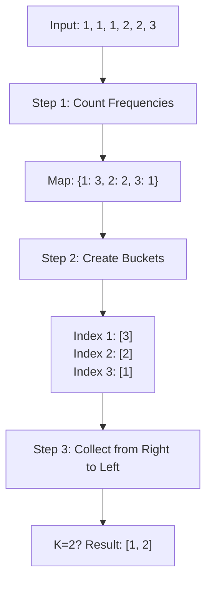

# 🎓 Expert Mentoring: Top K Frequent Elements

Sorting items by how often they appear is a task you'll encounter everywhere—from finding the most trending hashtags on social media to identifying the best-selling products in a store. Let's master the most efficient way to do it.

---

### 1. Problem Understanding

Imagine you have a big bag of colorful marbles. You want to find the \*\*\*\* colors that appear most often.

- **Input:** A bag of marbles `[Blue, Red, Blue, Green, Red, Blue]` and .
- **The Goal:** Find the 2 colors that show up the most.
- **Result:** Blue (3 times) and Red (2 times). So you return `[Blue, Red]`.

**Constraints:** You need to do this faster than a simple "sort everything" approach!

---

### 2. Pattern Recognition: The "Frequency Map + Bucket Sort"

To solve this, we combine two powerful patterns:

1. **Frequency Counting:** We first need to know exactly how many times each number appears. A **HashMap** is the perfect "tally sheet" for this.
2. **Bucket Sort (Optimized):** Usually, we might sort the frequencies. But sorting takes time. We can do better! Since the maximum possible frequency is the total number of elements (), we can create "buckets" where the index represents the **frequency**.

**When to use this:**

- When you need to find the "Top K" or "Most Frequent" items.
- When the range of frequencies is bounded by the size of the input.

---

### 3. Visual Explanation



---

### 4. Step-by-Step Solution

Let's use `nums = [1, 1, 1, 2, 2, 3]` and `k = 2`.

1. **Tally them up:** Use a HashMap to count.

- `1` appears **3** times.
- `2` appears **2** times.
- `3` appears **1** time.

2. **Prepare the Buckets:** Create an array of lists. The size will be `nums.length + 1`.

- `Bucket[3]` gets `1` (because 1 appeared 3 times).
- `Bucket[2]` gets `2`.
- `Bucket[1]` gets `3`.

3. **Gather the Winners:** Start from the very last bucket (the highest frequency) and move backwards until you have collected numbers.

- Check `Bucket[6]` to `Bucket[4]`: Empty.
- Check `Bucket[3]`: Found `1`. (Total: 1)
- Check `Bucket[2]`: Found `2`. (Total: 2)

4. **Finish:** We have 2 items. Return `[1, 2]`.

---

### 5. Code Implementation (Java)

```java
/**
 * Time Complexity: O(N) - We traverse the numbers, then the frequencies, then the buckets.
 * Space Complexity: O(N) - We store frequencies in a Map and elements in buckets.
 */
import java.util.*;

class Solution {
    public int[] topKFrequent(int[] nums, int k) {
        // 1. Build frequency map (Number -> How many times it appears)
        Map<Integer, Integer> countMap = new HashMap<>();
        for (int num : nums) {
            countMap.put(num, countMap.getOrDefault(num, 0) + 1);
        }

        // 2. Create buckets where index = frequency
        // We use an array of Lists because multiple numbers might have the same frequency
        List<Integer>[] buckets = new List[nums.length + 1];

        for (int number : countMap.keySet()) {
            int frequency = countMap.get(number);
            if (buckets[frequency] == null) {
                buckets[frequency] = new ArrayList<>();
            }
            buckets[frequency].add(number);
        }

        // 3. Collect the top k elements by iterating buckets backwards
        int[] result = new int[k];
        int resultCounter = 0;

        for (int i = buckets.length - 1; i >= 0 && resultCounter < k; i--) {
            if (buckets[i] != null) {
                for (int num : buckets[i]) {
                    result[resultCounter++] = num;
                    // Stop immediately if we've gathered k elements
                    if (resultCounter == k) {
                        return result;
                    }
                }
            }
        }

        return result;
    }
}

```

---

### 6. Complexity Analysis

- **Time Complexity: **
- Unlike sorting which takes , we only loop through the data a few times. Even the nested loop at the end only visits each unique number once across all buckets.

- **Space Complexity: **
- We use a Map to store up to entries and a bucket array that holds elements. This is the trade-off for the speed.

---

### 7. Similar Problems

1. **LeetCode 451: Sort Characters By Frequency** (Almost identical logic, but for characters).
2. **LeetCode 692: Top K Frequent Words** (Uses a Heap/PriorityQueue for lexicographical sorting).
3. **LeetCode 973: K Closest Points to Origin** (Another "Top K" problem usually solved with a Max-Heap).

---

### 8. Key Takeaways

- **Frequency First:** Always use a HashMap when you need to count occurrences.
- **Bucket Sort vs. Heap:** If you need time, use **Buckets**. If is very small or space is an issue, a **Min-Heap** () is a great alternative.
- **Index as Information:** In Bucket Sort, the **index** of the array itself carries information (in this case, the frequency).
