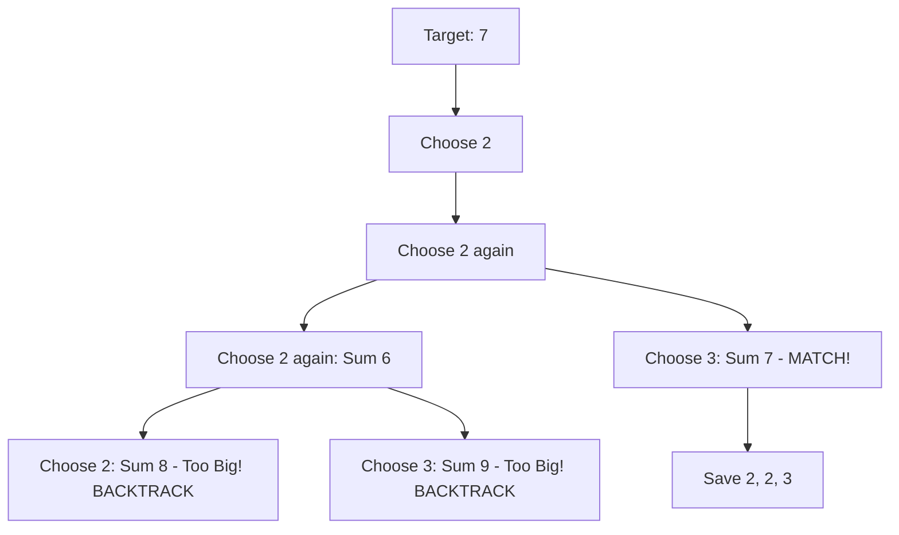

# 🎓 Expert Mentoring: Combination Sum

"Combination Sum" is the perfect playground for learning **Backtracking**. It’s like being in a candy store with a specific amount of money, where you can buy as many of the same candy as you want until you hit your budget exactly.

---

### 1. Problem Understanding

You are given a collection of unique numbers (candidates) and a **target** number. You need to find all unique combinations where the numbers add up to the target.

- **The Rule:** You can use the **same number** as many times as you like.
- **The Goal:** Every combination must be unique. (e.g., `[2, 2, 3]` is the same as `[3, 2, 2]`).
- **Example:** `candidates = [2, 3, 6, 7]`, `target = 7`
- One way: `[2, 2, 3]` (sum is 7)
- Another way: `[7]` (sum is 7)
- **Result:** `[[2, 2, 3], [7]]`

---

### 2. Pattern Recognition: Backtracking (The Decision Tree)

When a problem asks you to find **all possible** ways to do something, and you have to make a series of choices, you use **Backtracking**.

Think of it as exploring a maze:

1. **Choose:** Pick a number and add it to your current "shopping cart."
2. **Explore:** See if you can reach the target using that number (and others).
3. **Un-choose (Backtrack):** If you go over the target or finish a path, take the last number out of your cart and try a different one.

**When to use this:**

- When the problem asks for "All combinations," "All permutations," or "All paths."
- When you can reuse elements (like in this problem).

---

### 3. Visual Explanation

Let's try to get to **7** using `[2, 3, 6, 7]`.



---

### 4. Step-by-Step Solution

1. **Sort the candidates:** (Optional, but helps in stopping early if a number is already too big).
2. **Create a recursive function:** Pass in the remaining target, the current path, and the "start index" (so we don't pick the same combinations in a different order).
3. **Base Cases:**

- If `target == 0`: We found a winner! Add the current path to our results.
- If `target < 0`: we went too far. Stop this path.

4. **The Loop:**

- Starting from the `startIndex`, try adding each candidate to the path.
- **Crucial Step:** When we recurse, we pass the **current index** as the next `startIndex` because we are allowed to reuse the same number!

---

### 5. Code Implementation (Java)

```java
/**
 * Time Complexity: O(N^(T/M))
 * - N is the number of candidates, T is the target, M is the minimum value.
 * - This represents the exponential growth of the decision tree.
 * Space Complexity: O(T/M) - The maximum depth of the recursion stack.
 */
import java.util.*;

class Solution {
    public List<List<Integer>> combinationSum(int[] candidates, int target) {
        List<List<Integer>> result = new ArrayList<>();
        // Optional: Sorting allows us to break the loop early if nums become too large
        Arrays.sort(candidates);

        backtrack(result, new ArrayList<>(), candidates, target, 0);
        return result;
    }

    private void backtrack(List<List<Integer>> result, List<Integer> currentPath,
                           int[] candidates, int remaining, int start) {
        // Base Case 1: We hit the target exactly
        if (remaining == 0) {
            result.add(new ArrayList<>(currentPath));
            return;
        }

        for (int i = start; i < candidates.length; i++) {
            // Optimization: If the current candidate is larger than what's left,
            // no need to check it or any numbers after it (since they are sorted)
            if (candidates[i] > remaining) break;

            // 1. Choose: Add the number to our path
            currentPath.add(candidates[i]);

            // 2. Explore: Recurse with the updated remaining target
            // NOTE: We pass 'i' as the start index because we can reuse candidates[i]
            backtrack(result, currentPath, candidates, remaining - candidates[i], i);

            // 3. Backtrack: Remove the number so we can try the next candidate
            currentPath.remove(currentPath.size() - 1);
        }
    }
}

```

---

### 6. Complexity Analysis

- **Time Complexity: Exponential**
- In the worst case, the number of combinations grows very fast. If the target is large and the candidates are small (like `1`), the tree gets very deep.

- **Space Complexity: **
- is the target and is the smallest candidate. This is the maximum depth of our "recursion stack"—the height of our decision tree.

---

### 7. Similar Problems

1. **LeetCode 40: Combination Sum II** (Same thing, but you can only use each number **once**).
2. **LeetCode 77: Combinations** (Find all combinations of numbers from to ).
3. **LeetCode 46: Permutations** (Finding all possible orderings of a list).

---

### 8. Key Takeaways

- **State Management:** Backtracking is all about managing the "state" (what's in your current list).
- **The Recursive Leap:** Always remember to pass the `startIndex` to avoid duplicates like `[2, 3]` and `[3, 2]`.
- **Clean Up:** For every `.add()`, there must be a `.remove()` at the end of the function to reset the state for the next branch of the tree.
