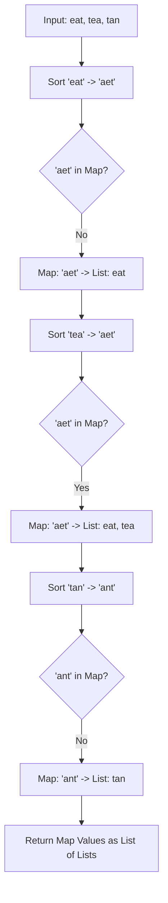

# 🎓 Expert Mentoring: Group Anagrams

In our previous session, we learned how to tell if two words are anagrams. Today, we’re taking it to the next level: sorting an entire "jumble" of words into groups where every word in a group is an anagram of the others.

---

### 1. Problem Understanding

Imagine you have a giant box of magnetic word tiles scattered on the floor. Some words use the exact same letters, just in a different order (like "eat", "tea", and "ate"). Your job is to pick them up and put all the "letter-twin" words into their own separate buckets.

- **Input:** `["eat", "tea", "tan", "ate", "nat", "bat"]`
- **Output:** `[["bat"], ["nat", "tan"], ["ate", "eat", "tea"]]`

**The Goal:** Group all strings that contain the exact same characters with the exact same frequencies.

---

### 2. Pattern Recognition: The "Canonical Form" (Standardizing)

How do we know "eat" and "tea" belong in the same bucket? We need a way to make them look **identical** so we can use them as a key in a map. This is called creating a **Canonical Form**.

There are two common ways to "standardize" an anagram:

1. **Sorting:** Sort the letters alphabetically. `eat` → `aet`, `tea` → `aet`. Now they match!
2. **Frequency Counting:** Count the letters. Both have `1a, 1e, 1t`.

For this mentor session, we will use the **Sorting** approach because it is very intuitive, and then store these groups in a **HashMap**.

**When to use this pattern:**

- When you need to categorize items based on a shared property.
- When you need to group "scrambled" data.

---

### 3. Visual Explanation



---

### 4. Step-by-Step Solution

Let's use the example: `["eat", "tea", "tan"]`

1. **Create a Map:** We need a storage system where the `Key` is the sorted word and the `Value` is a list of all original words that match that sort.
2. **Iterate:** Take the first word, `"eat"`.

- Sort it: `"aet"`.
- Is `"aet"` a bucket in our map? No. Create it.
- Map: `{"aet": ["eat"]}`

3. **Next word:** `"tea"`.

- Sort it: `"aet"`.
- Is `"aet"` a bucket? Yes! Put `"tea"` inside.
- Map: `{"aet": ["eat", "tea"]}`

4. **Next word:** `"tan"`.

- Sort it: `"ant"`.
- Is `"ant"` a bucket? No. Create it.
- Map: `{"aet": ["eat", "tea"], "ant": ["tan"]}`

5. **Final Result:** Just pull out all the lists (the values) from our map.

---

### 5. Code Implementation (Java)

```java
/**
 * Time Complexity: O(N * K log K)
 * - N is the number of strings.
 * - K is the maximum length of a string.
 * - We sort each string (K log K) and do this N times.
 * Space Complexity: O(N * K)
 * - We store all strings in the HashMap.
 */
import java.util.*;

class Solution {
    public List<List<String>> groupAnagrams(String[] strs) {
        // If the input is empty, return an empty list
        if (strs == null || strs.length == 0) {
            return new ArrayList<>();
        }

        // The Map stores: Key = Sorted String, Value = List of original Anagrams
        Map<String, List<String>> anagramGroups = new HashMap<>();

        for (String currentWord : strs) {
            // Convert string to char array to sort it
            char[] characters = currentWord.toCharArray();
            Arrays.sort(characters);

            // This 'sortedKey' becomes the "ID" for this anagram group
            String sortedKey = String.valueOf(characters);

            // If the key doesn't exist, create a new list for this bucket
            if (!anagramGroups.containsKey(sortedKey)) {
                anagramGroups.put(sortedKey, new ArrayList<>());
            }

            // Add the original word to the matching bucket
            anagramGroups.get(sortedKey).add(currentWord);
        }

        // Return all the lists we created in the map
        return new ArrayList<>(anagramGroups.values());
    }
}

```

---

### 6. Complexity Analysis

- **Time Complexity: **
- We look at words. For every word, we sort its letters. If the average word length is , sorting takes .

- **Space Complexity: **
- We are storing every single word from the input inside our HashMap, so the space used grows linearly with the total number of characters.

---

### 7. Similar Problems

Now that you've used a Map to group things by a "Canonical Form," try these:

1. **LeetCode 242: Valid Anagram** (The simpler, two-word version of this).
2. **LeetCode 128: Longest Consecutive Sequence** (Using a HashSet to group numbers by their neighbors).
3. **LeetCode 347: Top K Frequent Elements** (Grouping numbers by their frequency).

---

### 8. Key Takeaways

- **The Power of Sorting:** Sorting is a great way to "normalize" data so that different variations (like anagrams) look exactly the same.
- **HashMap as a Grouper:** Whenever a problem asks you to "Group items by X," a `HashMap<X, List<Item>>` is almost always the right tool for the job.
- **Data Transformation:** Sometimes, you can't compare items directly. You have to transform them into a "key" first.
