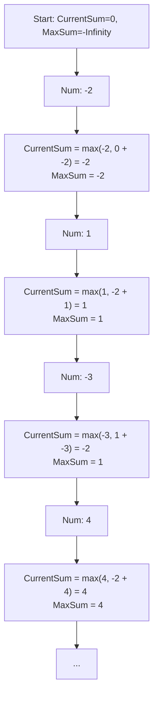

# 🎓 Expert Mentoring: Maximum Subarray

The "Maximum Subarray" problem is the quintessential example of **Kadane’s Algorithm**. It teaches us a vital life lesson and a coding lesson: "Sometimes, starting over is better than carrying a heavy burden from the past."

---

### 1. Problem Understanding

Imagine you are playing a game where you walk along a path of numbers. Some numbers give you points (positive), and some take points away (negative). You want to pick a **continuous segment** of the path that gives you the highest total score.

- **Example:** `nums = [-2, 1, -3, 4, -1, 2, 1, -5, 4]`
- **The Goal:** Find the connected "slice" of the array with the largest sum.
- **Result:** `[4, -1, 2, 1]` which adds up to **6**.

**The Rule:** The numbers must be next to each other. You can't just pick all the positive numbers and skip the negatives!

---

### 2. Pattern Recognition: Kadane’s Algorithm (Greedy/DP)

A naive approach would be to check every possible start and end point (), but that's too slow for large paths. Instead, we use a **Greedy** approach.

**The Strategy:**
As you walk through the array, at every step you ask yourself:
_"Is it better to add this current number to my existing 'train' of numbers, or should I kick the old train away and start a brand new one with just this number?"_

If your existing train sum becomes negative, it’s a "burden." It will only make your future sum smaller. In that case, you **reset** and start fresh from the current number.

**When to use this:**

- When you need to find a maximum sum or product of a **contiguous** subarray.
- When you can make a local decision that leads to a global optimum.

---

### 3. Visual Explanation



---

### 4. Step-by-Step Solution

Let's use a simple example: `nums = [-2, 1, -3, 4]`

1. **Start:** `currentSum = 0`, `maxSum = -infinity`.
2. **Number -2:**

- `currentSum` becomes `-2`.
- `maxSum` is now `-2`.

3. **Number 1:**

- Should we do `-2 + 1 = -1` or just start at `1`?
- `1` is bigger! `currentSum = 1`.
- `maxSum` is now `1`.

4. **Number -3:**

- `1 + (-3) = -2`. Since `-2 > -3`, we keep the train: `currentSum = -2`.
- `maxSum` stays `1`.

5. **Number 4:**

- Should we do `-2 + 4 = 2` or just start at `4`?
- `4` is bigger! `currentSum = 4`.
- `maxSum` is now `4`.

---

### 5. Code Implementation (Java)

```java
/**
 * Time Complexity: O(N) - We only iterate through the array once.
 * Space Complexity: O(1) - We only store two variables.
 */
class Solution {
    public int maxSubArray(int[] nums) {
        // We initialize currentSum to 0
        int currentSum = 0;
        // We initialize maxSum to the first element to handle
        // arrays with only negative numbers
        int maxSum = nums[0];

        for (int num : nums) {
            // STEP 1: Decide whether to add current number to the existing sum
            // or start a new subarray from the current number.
            // If currentSum was negative, num will always be greater than (currentSum + num).
            currentSum = Math.max(num, currentSum + num);

            // STEP 2: Update the global maximum if our current subarray is the best we've seen.
            maxSum = Math.max(maxSum, currentSum);
        }

        return maxSum;
    }
}

```

---

### 6. Complexity Analysis

- **Time Complexity: **
- We make one single trip across the array. Each stop takes the same tiny amount of time.

- **Space Complexity: **
- We don't need any extra lists. We just keep two "running totals" in our head.

---

### 7. Similar Problems

1. **LeetCode 152: Maximum Product Subarray** (Trickier because two negatives make a positive!).
2. **LeetCode 121: Best Time to Buy and Sell Stock** (Essentially Kadane’s logic applied to price differences).
3. **LeetCode 918: Maximum Sum Circular Subarray** (A fun twist where the end of the array connects to the start).

---

### 8. Key Takeaways

- **The "Reset" Logic:** If your `currentSum` drops below zero, it's essentially "dead weight." Start your subarray count over from the current element.
- **Global vs. Local:** Keep one variable for the "best subarray ending right here" and one for the "best subarray seen anywhere so far."
- **Negative Numbers:** Initializing `maxSum` to `nums[0]` (instead of `0`) ensures the code works even if all numbers in the array are negative.
