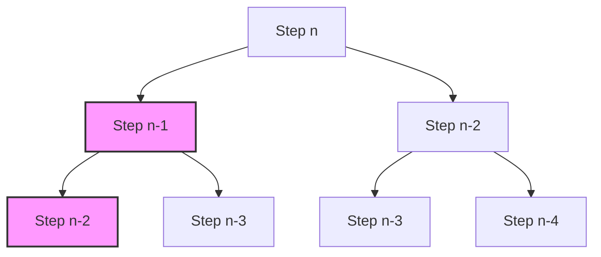

# 🎓 Expert Mentoring: Climbing Stairs

This problem is a fantastic introduction to the world of **Dynamic Programming**. It shows how a seemingly complex counting problem can be broken down into simple steps we've already solved.

---

### 1. Problem Understanding

Imagine you are standing at the bottom of a staircase. You want to reach the top, which is \*\*\*\* steps away.

- **The Rule:** You can climb either **1 step** or **2 steps** at a time.
- **The Goal:** In how many distinct ways can you climb to the top?

**Example: **

1. 1 step + 1 step + 1 step
2. 1 step + 2 steps
3. 2 steps + 1 step

- **Result:** 3 ways.

---

### 2. Pattern Recognition: Decision Trees & Overlapping Subproblems

To reach the -th step, where could you have come from?

1. You could have been at step \***\* and taken a **1-step\*\* jump.
2. You could have been at step \***\* and taken a **2-step\*\* jump.

This means:

Wait a minute... that looks exactly like the **Fibonacci Sequence**!

**When to use this pattern (Dynamic Programming):**

- When a problem can be broken down into smaller versions of itself (Recursive structure).
- When you notice you are calculating the same things over and over (Overlapping subproblems).

---

### 3. Visual Explanation



_Notice how "Step n-2" is calculated multiple times? That's why we use DP to store the answer the first time we find it!_

---

### 4. Step-by-Step Solution

Let's calculate for \*\*\*\*:

1. **Step 1:** Only 1 way (1).
2. **Step 2:** 2 ways (1+1, 2).
3. **Step 3:** (Ways to Step 2) + (Ways to Step 1) = .
4. **Step 4:** (Ways to Step 3) + (Ways to Step 2) = .
5. **Step 5:** (Ways to Step 4) + (Ways to Step 3) = .

---

### 5. Code Implementation (Java)

```java
/**
 * Time Complexity: O(N) - We calculate each step exactly once.
 * Space Complexity: O(1) - We only store the last two steps.
 */
class Solution {
    public int climbStairs(int n) {
        // Base cases: if there are 0, 1, or 2 steps
        if (n <= 2) {
            return n;
        }

        // We only need to remember the last two steps to calculate the current one
        // This is an optimized version of DP called "Space Optimization"
        int firstStepBefore = 2; // Ways to reach step 2
        int secondStepBefore = 1; // Ways to reach step 1
        int currentWays = 0;

        for (int i = 3; i <= n; i++) {
            // Current ways is the sum of the previous two
            currentWays = firstStepBefore + secondStepBefore;

            // Move our pointers forward for the next iteration
            secondStepBefore = firstStepBefore;
            firstStepBefore = currentWays;
        }

        return firstStepBefore;
    }
}

```

---

### 6. Complexity Analysis

- **Time Complexity: **
- We run a single loop from 3 up to . Each calculation is just a simple addition.

- **Space Complexity: **
- Instead of creating an entire array (which would be ), we only kept track of the last two values in variables. This is the most efficient way to solve it!

---

### 7. Similar Problems

1. **LeetCode 509: Fibonacci Number** (The math version of this exact problem).
2. **LeetCode 746: Min Cost Climbing Stairs** (Adds a "cost" to each step).
3. **LeetCode 198: House Robber** (A slightly more complex version of "making a choice at each step").

---

### 8. Key Takeaways

- **Recurrence Relation:** Most DP problems start with finding the formula (like ).
- **Iterative > Recursive:** While recursion is easier to visualize, an iterative loop uses less memory (no stack overflow!).
- **Space Optimization:** If your current answer only depends on the last 1 or 2 steps, you don't need an array—just a few variables.
